# SMOS ARM64 Architecture

This document combines the AArch64 architecture notes used by SMOS with the
platform mechanisms that matter to the Zircon microkernel, the QEMU arm64
board, and the optional virtualization stack.  It covers ARMv8-A and the
ARMv9-compatible instructions that are relevant to system software.

## SMOS execution model

SMOS runs Zircon at EL1 and places the component framework, drivers, shells,
and virtualization services in user space.  Firmware or QEMU enters the
arm64 boot shim, which loads the ZBI and transfers control to Zircon.  The
microkernel owns scheduling, virtual memory, interrupt delivery, objects, and
syscalls; user space owns policy and device protocols.

```text
                    QEMU virt machine / ARM firmware
                                  |
                    boot shim -> kernel.phys -> ZBI
                                  v
        +----------------------------------------------------+
        | Zircon EL1: scheduler, VM, objects, IRQs, syscalls |
        +-------------------------+--------------------------+
                                  |
              handles, VMOs, channels, sockets, FIDL protocols
                                  v
        +----------------------------------------------------+
        | SMOS user space: userboot, component_manager,      |
        | driver_manager, virtio drivers, console, dash, VMM |
        +-------------------------+--------------------------+
                                  |
                    GICv3 / UART / PCI / virtio / SMMU
```

The SMOS arm64 board uses QEMU's `virt` machine with GICv3 and a low PCI ECAM
window.  The default product is console-only; graphics and conventional IP
networking are outside its scope.  The optional virtio-vsock path uses the
same EL1 object and capability model as the rest of the product.

## AArch64 ISA

The AArch64 ISA provides 31 general-purpose registers, `x0` through `x30`.
`x30` is the link register, and `sp` is the stack pointer.  AArch64 stacks
must remain 128-bit aligned at every public call boundary.

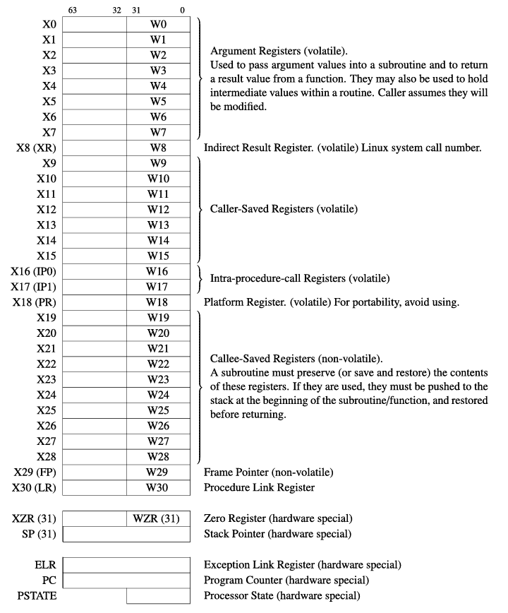

The complete instruction reference is available in
[`ARM_instruction_set.pdf`](assets/arm64/ARM_instruction_set.pdf).  The
following instructions occur frequently in boot and kernel code:

### Bit manipulation

`BFI` inserts a bit field, while `UBFX` extracts an unsigned bit field.

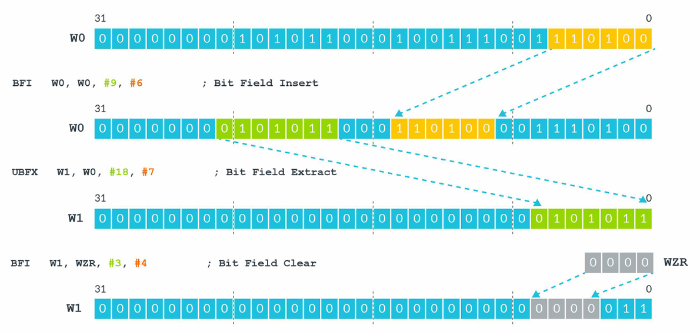

### Load/store pairs

`stp` and `ldp` transfer two registers in one instruction and are commonly
used to save and restore stack frames:

```asm
stp     x0, x1, [sp, #-16]!
ldp     x0, x1, [sp], #16
```

### PC-relative addresses

`adr` computes a label address within approximately +/-1 MiB.  `adrp` computes
the 4 KiB page address of a label within approximately +/-4 GiB; an `add` then
supplies the page offset.  This is the usual position-independent sequence:

```asm
adrp    x0, symbol
add     x0, x0, :lo12:symbol
```

### Exception return

`eret` restores `PSTATE` from the current exception level's `SPSR` and branches
to `ELR`.  Zircon exception vectors use this instruction after dispatching a
syscall, fault, IRQ, or other exception.

## Memory system

The cache hierarchy is implementation-defined, but a typical arm64 system has
private L1/L2 caches and a larger shared L3 cache.  Cache lines are commonly 64
bytes.  Temporal locality keeps recently used lines close to a core; spatial
locality makes adjacent lines useful for sequential accesses.

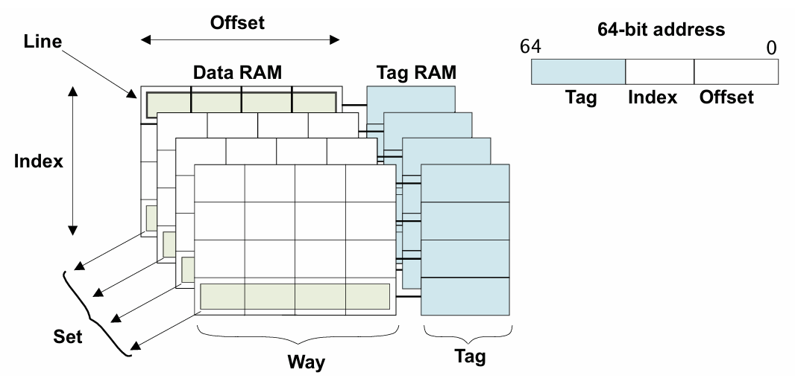

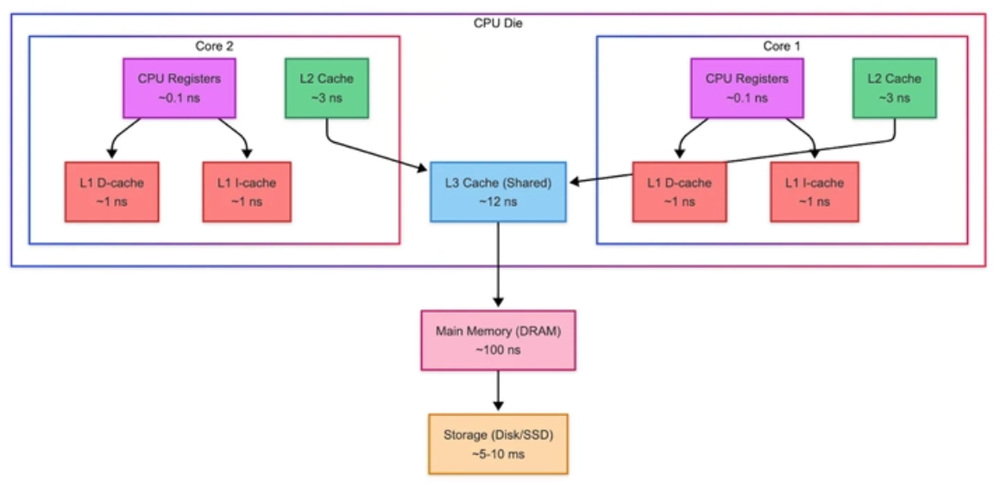

SMOS also models the multi-core system explicitly:

- **SMP** gives every core the same view of memory and shared hardware.
- **AMP** assigns statically different software roles to different cores.
- **HMP** combines performance and efficiency cores, as in big.LITTLE systems.

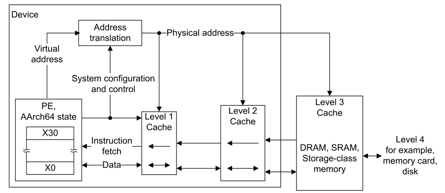

### Address translation

The MMU translates a virtual address to a physical address by reading the
translation-table base register and walking the descriptors at each level.
Zircon creates VMOs and VMARs and programs the arm64 page tables; user
processes receive mappings through handles rather than by writing page-table
descriptors directly.

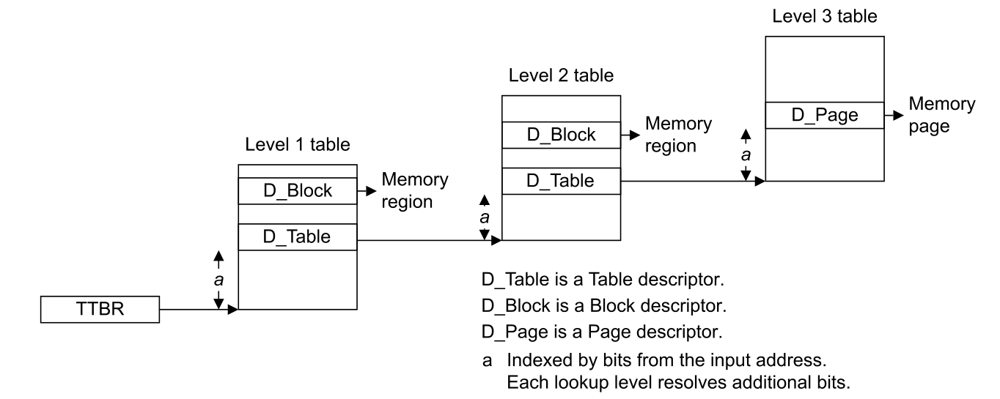

### Memory ordering

Arm64 uses a weak memory-ordering model.  Instructions still retire according
to the architectural execution rules, but independent loads and stores can be
issued, completed, or observed out of program order.  The processor and the
interconnect can therefore overlap cache misses, write-buffer drains, and
device transactions.  A single-core test may appear correct while a second
core or a device observes the operations in a different order.

For a producer/consumer hand-off, the producer must make the data visible
before publishing the descriptor, and the consumer must acquire the
descriptor before reading the data:

```text
Producer: write payload -> DMB/DSB -> publish ready flag
                                      |
                                      v
Consumer: read ready flag -> DMB    -> read payload
```

The three architectural barriers have different guarantees:

| Barrier | Guarantee | Typical SMOS use |
| --- | --- | --- |
| `DMB` | Orders explicit memory accesses around the barrier. | Publish a ring-buffer entry before an IRQ or doorbell. |
| `DSB` | Waits until selected memory effects are complete. | Finish cache maintenance before handing a buffer to DMA. |
| `ISB` | Flushes the instruction stream and synchronizes execution context. | Apply a new translation, control, or exception-vector setting. |

`DMB` does not wait for a peripheral to finish, and `DSB` does not make a
non-atomic read/modify/write sequence atomic.  Use acquire/release atomics or
exclusive accesses for ownership state, then use the appropriate barrier when
that state crosses a CPU, interrupt, or device boundary.  Device register
accesses should use the accessors supplied by the driver framework rather than
ordinary C pointer dereferences.

### Memory types and attributes

Arm64 classifies every translation as **Normal memory** or **Device memory**.
The type is selected by the page-table descriptor and is not a property that a
user process can change with a normal load or store.

| Type | Intended contents | Permitted optimization |
| --- | --- | --- |
| Normal | RAM, code, stacks, VMOs, and frame buffers. | Caching, speculation, gathering, and reordering according to the mapping. |
| Device | MMIO registers and explicitly device-owned windows. | Restricted speculation and ordering suitable for side-effecting accesses. |

Normal memory has cacheability and shareability attributes.  A cacheable
mapping can retain dirty lines in a write-back cache; a non-cacheable mapping
must reach the memory system for each access.  Device memory adds three
independent properties:

- `G`/`nG` controls whether adjacent accesses may be gathered;
- `R`/`nR` controls whether accesses may be reordered; and
- `E`/`nE` controls early write acknowledgement from an intermediate buffer.

`Device-nGnRnE` is the most restrictive common device mapping.  It is a safe
default for registers with strong side effects, but it can be unnecessarily
slow for a bulk data window.  A less restrictive mapping is valid only when
the device specification permits gathering, reordering, and early completion.
Mapping an MMIO register as Normal memory is unsafe because speculative or
reordered accesses can trigger an operation that software did not request.

### MAIR and page-table selection

The Memory Attribute Indirection Register (`MAIR_ELn`) contains up to eight
8-bit attribute encodings.  Each leaf page-table descriptor carries an
`AttrIndx[2:0]` field that selects one encoding.  During a TLB miss, the MMU
combines the descriptor's index with `MAIR_EL1` to determine how that page is
accessed:

```text
virtual address
      |
      v
translation-table walk -> leaf descriptor -> AttrIndx[2:0]
                                                   |
                                                   v
                                            MAIR_EL1 entry
                                                   |
                                                   v
                                   Normal/Device + cache/shareability rules
```

The attribute granularity is a page, not a C/C++ object.  Two buffers in one
page cannot safely require incompatible memory types.  Zircon's VMOs and VMARs
must therefore keep page alignment and mapping permissions consistent with the
board's memory description.  A driver that maps a register range must also
preserve the range's Device type when it creates a user-visible mapping.

### Cache hierarchy and write buffers

An access can be delayed at several levels: a private L1 cache, a private or
cluster L2 cache, a shared last-level cache, a write buffer, the interconnect,
or the target device.  A store can retire after entering a write buffer while a
load that misses in every cache waits for the external response.  This is why
a profiler can attribute most of a loop's time to a simple arithmetic
instruction: the instruction may be waiting on an older memory dependency.

Write combining coalesces adjacent stores or repeated stores to the same
cache line.  It improves sequential output but does not make a buffer visible
to a device by itself.  The software ownership transition still needs the
barrier and cache-maintenance operation required by the platform.

### Shareability domains

Shareability states the hardware scope in which cache coherence is guaranteed:

1. **Non-shareable**: one processing element or a private cache hierarchy.
2. **Inner Shareable**: the cores in one coherency cluster.
3. **Outer Shareable**: multiple clusters joined by the system interconnect.
4. **System Shareable**: all relevant agents, including DMA, GPU, and NPU.

The label is not a promise that every device is coherent.  A DMA engine behind
a non-coherent bridge can still require explicit cache maintenance even when
the CPU mapping is marked shareable.  The platform's interconnect and IOMMU
configuration determine whether the System Shareable domain includes that
device.

### DMA ownership and cache coherency

DMA removes the CPU from the byte-copy path, but it creates a cache ownership
problem.  A CPU write can be newer than DRAM because it is dirty in a cache; a
device write can be newer than a stale CPU cache line.  Treat a DMA buffer as a
small state machine:

```text
CPU-owned, writable
        |
        +-- clean cache lines; DMB/DSB; publish descriptor
        v
Device-owned, in-flight
        |
        +-- device completion/IRQ; reclaim ownership
        v
CPU-owned, readable
        |
        +-- invalidate or synchronize cache lines before reading
        v
CPU-owned, writable again
```

For a non-coherent device, the usual directions are:

- **CPU -> device**: complete CPU stores, clean the relevant cache lines, then
  publish the descriptor and start the device;
- **device -> CPU**: wait for completion, invalidate or synchronize stale cache
  lines, then read the payload; and
- **bidirectional**: use a platform-defined clean/invalidate sequence and keep
  ownership exclusive while the device is active.

System-level hardware coherence can remove some explicit cache operations, but
it does not remove the ownership protocol, descriptor ordering, or lifetime
rules.  Never infer DMA visibility merely from a successful `memcpy()` or from
the fact that two virtual mappings refer to the same VMO.

### SMMU, BTI, and SMOS buffers

In SMOS, a VMO identifies storage, a BTI limits which physical memory a device
can access, and an SMMU/IOMMU can translate or reject the device's DMA address.
These mechanisms solve different parts of the problem:

| Mechanism | Protects or describes |
| --- | --- |
| VMO/VMAR | Which user-space component can map and access the bytes. |
| BTI | Which physical pages a device is permitted to pin or use for DMA. |
| SMMU/IOMMU | How a device address is translated and which ranges are rejected. |
| Cache/barrier operations | When CPU and device observations become ordered and coherent. |

An IOMMU mapping is not a cache flush, and a cache flush is not an access
control boundary.  Drivers must establish both before starting a transfer.
When the board lacks system-level coherence, the driver must use the
platform's cache-maintenance primitives around the DMA ownership transitions.

### Memory and DMA performance diagnosis

When a DMA path is unexpectedly slow, measure the directions independently:

1. CPU-only sequential reads from Normal cacheable memory;
2. CPU-only sequential writes to the same memory;
3. CPU reads from the device's buffer mapping;
4. CPU writes to the device's buffer mapping; and
5. end-to-end device-to-memory and memory-to-device transfers.

Record page size, cacheability, memory type, shareability, alignment, transfer
size, and whether the path is hardware-coherent.  A read-heavy workload on an
uncached Device mapping can be much slower than a write-heavy workload because
stores may be posted or combined while loads wait for the external target.
Cache-miss counters alone do not identify this case: a stalled load, an
interconnect queue, or a write-buffer drain can dominate the elapsed time.

Common mistakes are mapping registers as Normal memory, using a cacheable
buffer without a DMA ownership transition, issuing `DMB` where completion
requires `DSB`, and reusing a descriptor before the device has returned it.
Keep the descriptor, buffer, interrupt, and reclamation protocol explicit in
the driver state machine.

## Exceptions and exception levels

Synchronous exceptions are associated with the executing instruction:

- invalid instructions and trap instructions;
- memory-access faults;
- `SVC`, `HVC`, and `SMC` calls; and
- debug exceptions.

Asynchronous exceptions arrive independently of the current instruction:

- physical and virtual interrupts;
- IRQ and FIQ; and
- SError.

IRQ and FIQ can be masked temporarily, leaving the interrupt pending until it
is unmasked.  The exception vector selects a handler based on the current
exception level and whether the lower context is AArch64 or AArch32.

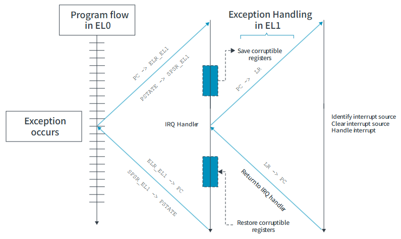

ARMv8-A defines EL0 through EL3.  SMOS user processes execute at EL0 and
Zircon executes at EL1.  A hypervisor, when present, executes at EL2; firmware
and secure-monitor code execute at EL3.  `SVC`, `HVC`, and `SMC` are exception
generators that provide entry points into those higher-level services.

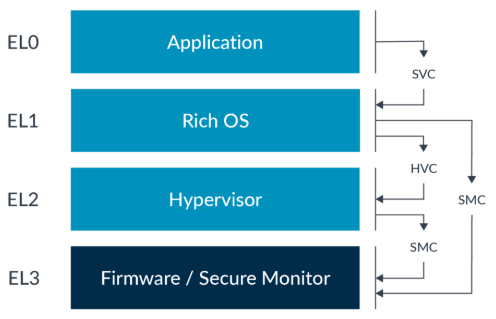

## Synchronization and atomics

Arm exclusive accesses support lock-free synchronization:

```asm
FUNCTION(arch_spin_lock)
    mov     x1, #1
    sevl
1:
    wfe
    ldaxr   x2, [x0]
    cbnz    x2, 1b
    stxr    w2, x1, [x0]
    cbnz    w2, 1b
    ret

FUNCTION(arch_spin_unlock)
    stlr    xzr, [x0]
    ret
```

`ldaxr` is an acquire load-exclusive operation.  `stxr` conditionally stores
and returns zero on success.  `stlr` is a release store.  `sevl` primes the
local event state and `wfe` waits for an event, reducing contention in the
retry loop.

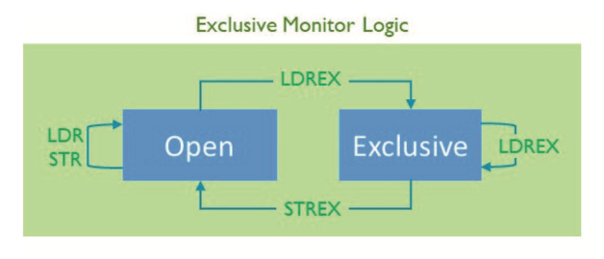

## GICv3 interrupt controller

The Generic Interrupt Controller (GIC) routes interrupt sources to processor
elements (PEs).  SMOS arm64 uses the QEMU GICv3 model.

### Components

- **Distributor** prioritizes and distributes SPIs and SGIs.
- **Redistributor** holds per-PE state for PPIs and LPIs.
- **CPU interface** acknowledges interrupts, drops priority, masks priorities,
  and identifies the highest-priority pending interrupt.
- **ITS** is an optional translation service that maps device EventIDs to LPI
  interrupt IDs through a command queue and in-memory tables.

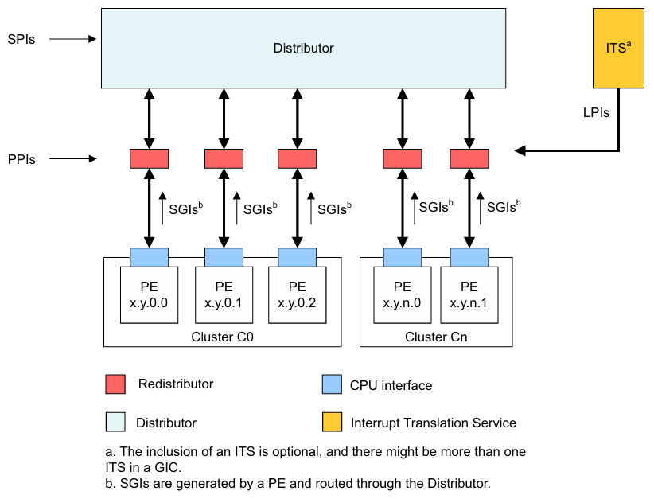

### Physical IRQ lifecycle

1. A peripheral or software generates an interrupt.
2. The GIC prioritizes and distributes it.
3. The CPU interface delivers it to the PE.
4. Software acknowledges it, making it active (and possibly still pending).
5. Software performs a priority drop after the handler has made progress.
6. Software deactivates it, allowing a pending interrupt to be delivered again.

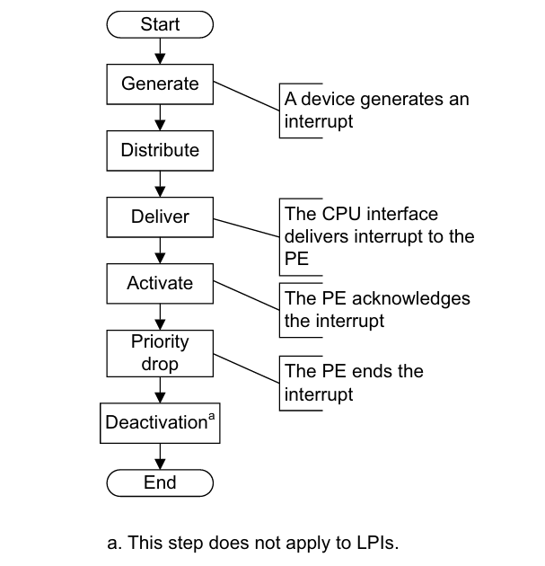

The state transitions are inactive -> pending -> active and pending -> active
-> inactive.  A peripheral normally clears the source between the latter two
states; software writes the End of Interrupt register to complete handling.

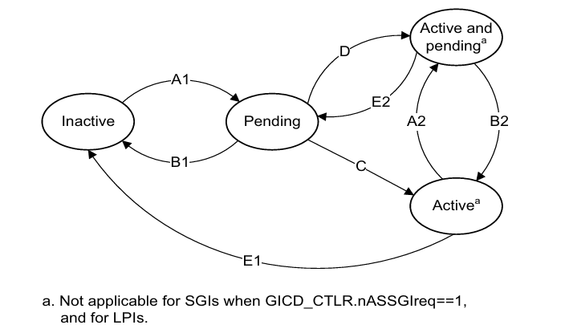


## SMMUv3 and DMA

An SMMU translates addresses in DMA requests from I/O devices.  It is separate
from the PE MMU: the PE translates virtual addresses, while the SMMU protects
device access to physical or intermediate physical addresses.

A StreamID selects a Stream Table Entry (STE).  An STE enables the stream and
selects stage 1 translation, stage 2 translation, or both:

- stage 1 translates a device virtual address to an IPA using Context
  Descriptors (CDs) and an ASID;
- stage 2 translates an IPA to a PA using a VMID and stage-2 tables; and
- multiple devices can share stage-2 tables while retaining separate STEs.

Stream tables can be linear or two-level.  The two-level form bounds the amount
of memory needed for sparse StreamID ranges.

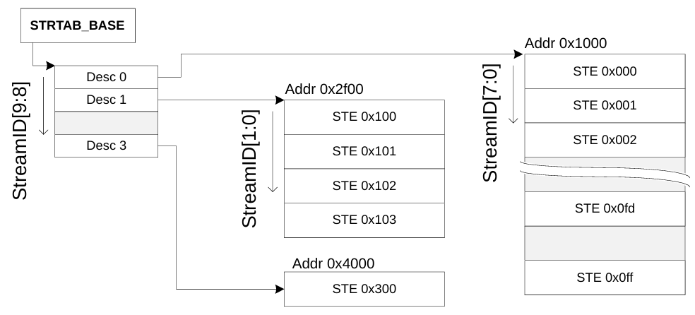

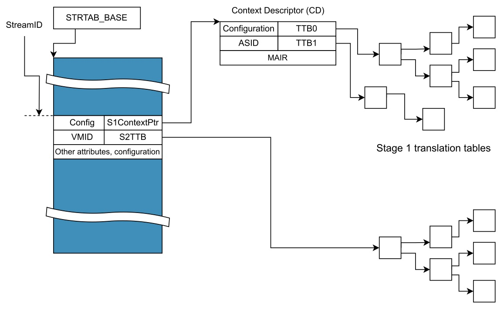

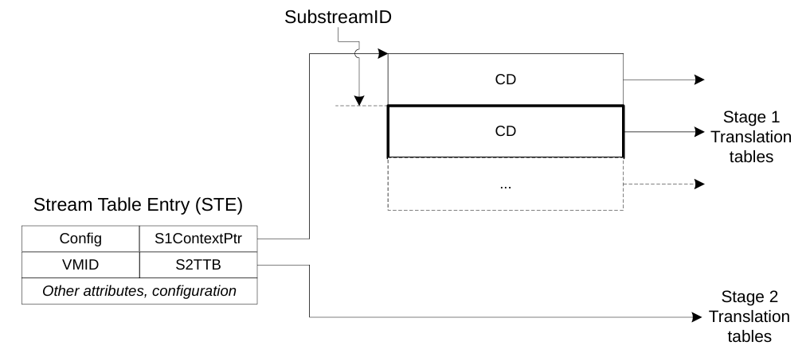

When SMOS hosts a virtual machine, the hypervisor must ensure that device DMA
cannot escape the guest's assigned address space.  The exact SMMU programming
is platform-dependent; the conceptual contract is the same as Zircon's VMO,
BTI, and IOMMU capability boundaries.

## TrustZone and secure calls

TrustZone divides the system into a Normal World (REE) and a Trusted World
(TEE), with hardware-enforced isolation.  SMOS normally runs in the Normal
World; a secure monitor or TEE may remain outside the SMOS product boundary.

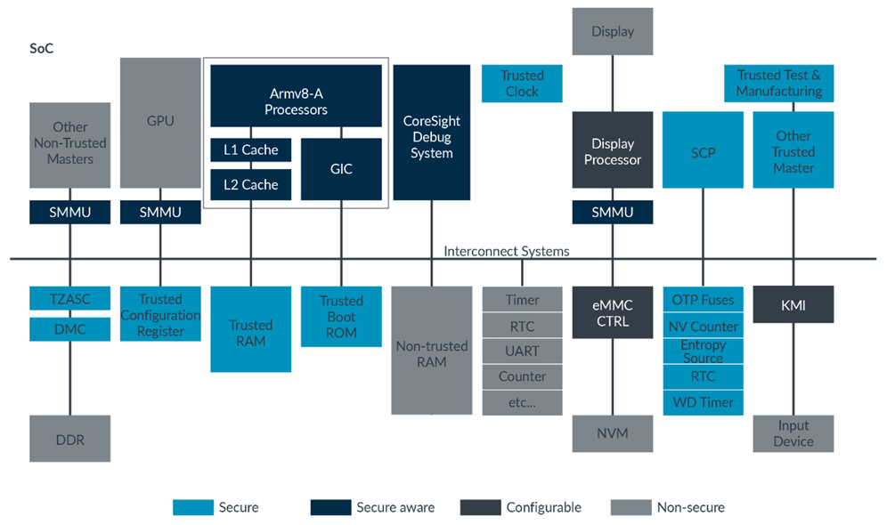

The Secure Monitor Calling Convention (SMCCC) defines register arguments and
results for `SMC` and `HVC` calls.  The caller must preserve the convention's
width, ownership, and error-return rules across an exception-level transition.

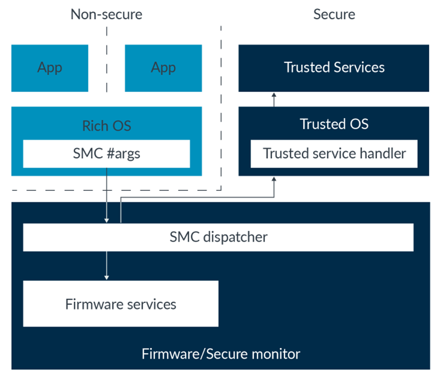

See [`Hypervisor.md`](Hypervisor.md) for SMOS virtualization boundaries.  TEE
firmware and secure-monitor interfaces remain platform-specific and outside
the default SMOS product.

## SMOS arm64 mapping

| ARM64 mechanism | SMOS use |
| --- | --- |
| EL0/EL1 | dash and components at EL0; Zircon at EL1 |
| VM/VMAR/page tables | process isolation, BootFS mappings, and VMO-backed memory |
| GICv3 | QEMU physical IRQ delivery to Zircon and drivers |
| PCI ECAM | userspace PCI root and virtio device discovery |
| SMMU/IOMMU | DMA isolation when the platform supplies an SMMU |
| EL2 | optional arm64 hypervisor host for guest VMs |
| virtio-vsock | opt-in host file export through `vsock` on port 4050 |
| EL3/TrustZone | firmware and secure monitor outside the default product |

For boot order and image construction, see [`SMOS.md`](SMOS.md) and
[`Workflow.md`](Workflow.md).  For the user-facing dash commands, see
[`sdk/docs/man.txt`](../docs/man.txt).

---

Hustle Embedded OS, 2026.
