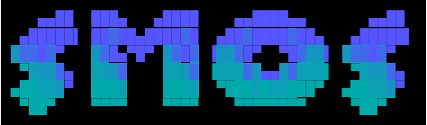

# SMOS Architecture Guide




SMOS is a console-only Fuchsia/Zircon server profile. It retains the original
Zircon dash shell, process and storage primitives, component and driver
frameworks, diagnostics, QEMU serial/block/RTC/random devices, virtio socket,
and the arm64 virtualization host stack. Runtime graphics, UI, netstack,
physical network drivers, WLAN, Bluetooth, audio, camera, update, and recovery
packages are deliberately absent. Virtio socket remains as a virtualization
transport and does not install a conventional network stack.

The compact source tree must remain below 500,000 KiB (524,288,000 bytes), not
counting `.git/`, generated `out/`, or the separately measured standalone SDK
`prebuilt/` payload.

## Microkernel architecture

A microkernel keeps the privileged kernel small and moves policy-heavy services
to user space. The kernel provides mechanisms that must be trusted by every
process: CPU scheduling, virtual memory, address spaces, kernel objects,
capability-bearing handles, interrupt delivery, and the syscall entry path.
Higher-level policy is implemented by isolated processes and components that
communicate through channels and framework protocols.

```text
┌──────────────────────────── SMOS user space ──────────────────────────────┐
│ component_manager │ drivers │ fshost │ console │ VMM │ dash               │
│      FIDL channels, namespaces, devfs, files, and user policy             │
└──────────────────────────────────┬────────────────────────────────────────┘
                                   │
                    handles + rights + IPC messages
                                   │
┌──────────────────────────────────▼────────────────────────────────────────┐
│                              Zircon kernel                                │
│ processes/threads │ VMOs/VMARs │ channels/sockets │ ports │ syscalls      │
│ jobs/handles      │ interrupts │ timers/signals   │ VM    │ object rights │
└──────────────────────────────────┬────────────────────────────────────────┘
                                   │
┌──────────────────────────────────▼────────────────────────────────────────┐
│                       hardware, firmware, and monitors                    │
│              UART │ QEMU virtio │ GIC/PLIC │ EL2/EL3 monitor              │
└───────────────────────────────────────────────────────────────────────────┘
```

The boundary is a separation of authority, not merely a directory split. A
user-space driver cannot directly modify another process's address space, and a
component receives only the handles and namespace entries offered to it by the
component framework. A request crosses the boundary through a syscall or an
IPC message; the kernel validates the caller's handle rights and memory ranges
before performing the operation. This keeps the trusted computing base focused
and makes service failure more containable: restarting a driver-host does not
restart the kernel or unrelated components.

In SMOS, the boot-shim and the Zircon physical loader prepare the kernel and
its boot items. `userboot` then starts `component_manager`, which constructs the
user-space component graph. `driver_manager` and `driver_index` discover and
launch user-mode drivers, while `console-launcher` starts the interactive dash
shell. The detailed physical hand-off and component startup sequence is
documented in [Boot-to-driver flow](#boot-to-driver-flow) and [Complete Zircon
boot-to-userspace code path](#complete-zircon-boot-to-userspace-code-path).

### Zircon microkernel introduction

Zircon is the low-level kernel used by Fuchsia and by SMOS. It is an
object-based microkernel: kernel resources are represented by typed objects,
and processes access those objects through local handles with explicit rights.
The handle model is the common substrate for component startup, FIDL IPC,
driver capabilities, memory mappings, and asynchronous waits.

The kernel's primary responsibilities are:

| Area | Zircon responsibility | SMOS consequence |
| --- | --- | --- |
| Tasks | jobs, processes, threads, scheduling, and task lifecycle | components and `driver-host` instances remain isolated processes |
| Memory | VMOs, VMARs, page mapping, faults, and pager hooks | BootFS, executable images, stacks, and shared buffers use the standard VM model |
| IPC and waiting | channels, sockets, ports, events, signals, and timers | FIDL services and console/driver event loops share one kernel object model |
| Hardware boundary | interrupts, MMIO/resource checks, BTI/IOMMU and architecture entry paths | user-mode drivers receive only the hardware capabilities they are offered |
| ABI and diagnostics | `zx_*` syscalls, vDSO entry points, debuglog, and exception delivery | SMOS keeps the standard Zircon syscall and object ABI |

Zircon does not provide the product's policy services. It does not resolve
component URLs, match driver bind rules, mount a user-facing filesystem, or
implement the dash command language. Those functions belong to
`component_manager`, the driver framework, storage services, and user-space
programs. The kernel supplies the process, memory, IPC, and capability
mechanisms on which those services depend.

This distinction matters when reading the SMOS source tree. Changes under
`zircon/kernel/` modify trusted kernel mechanisms and must preserve the
standard Zircon ABI. Changes under `userspace/` usually modify policy,
protocols, or product assembly. SMOS reduces the user-space graph for a
console-only server profile; it does not fork Zircon into a separate server
kernel. The following runtime diagram and boot sections show how the two
halves join at `userboot` and `component_manager`.

## Runtime architecture

SMOS follows the standard Zircon/Fuchsia boot contract, but the product graph
only starts the console and the drivers needed by the headless server profile.
The boundary between kernel facilities and user-space drivers is important: the
kernel owns scheduling, VM, handles, interrupts, and syscall/object primitives;
the driver framework starts most concrete device drivers in isolated user-mode
`driver-host` components, where device protocols are published to clients.

```
SMOS runtime layers (logical view; boxes are components or subsystems):

    +------------------------ BOOT / PHYSICAL MODE -------------------------+
    | Firmware or QEMU                                                      |
    |        |                                                              |
    |        v                                                              |
    | Architecture boot-shim (arm64 / riscv64)                              |
    |        | parses DTB, cmdline; adds UART/memory/CPU/platform boot items|
    |        v                                                              |
    | ZBI: kernel + data ZBI                                                |
    +-------------------------------+---------------------------------------+
                                    |
                                    v
    +--------------------------- ZIRCON KERNEL -----------------------------+
    | phys hand-off -> Zircon kernel -> jobs/processes/VMOs/channels        |
    |                              -> interrupts and syscalls               |
    +-------------------------------+---------------------------------------+
                                    |
                                    v
    +------------------------- BOOTSTRAP COMPONENTS ------------------------+
    | userboot -> component_manager (root and bootstrap realms)             |
    |                         |                    |                        |
    |                         |                    +--> console + launcher  |
    |                         +--> fshost / storage                         |
    |                         +--> driver_manager                           |
    +-------------------------+--------------------+------------------------+
                              |                    |
                              v                    v
    +---------------------- USER-SPACE DRIVERS -----------------------------+
    | driver_index --bind rules--> driver-host --starts--> user-mode drivers|
    |       (match)                 (isolated)      (QEMU board, serial,    |
    |                                                 block, RTC, RNG)      |
    |                                   |                                   |
    |                                   +--------------+                    |
    |                                                  v                    |
    |                         devfs (/dev, /dev-topological)                |
    +--------------------------------------------------+--------------------+
                                                       |
                                                       v
    +------------------------------ CLIENTS --------------------------------+
    | console -> dash shell -> open/connect device protocols or FIDL        |
    +-----------------------------------------------------------------------+
```

These diagrams are a logical view, not a single process tree. `driver_manager`,
`driver_index`, `devfs`, and `driver-host` are components connected through FIDL
and framework protocols. A device node is matched by `driver_index`, launched by
`driver_manager`, and then exported by the driver to `devfs`; a shell command or
another component consumes that device through the published protocol.

### Boot-to-driver flow

The following sequence describes the path exercised by the SMOS QEMU images.
The arm64 and riscv64 shims both parse the incoming devicetree, populate boot
items, and transfer control to the ZBI; architecture-specific items differ
(GIC/PSCI/timer on arm64, PLIC/timer on riscv64).

The phys handoff has two distinct `PhysMain` implementations in two different
ELF images.  The boot-shim `PhysMain` prepares the incoming ramdisk and calls
`BootZbi::Boot()`.  The Zircon `kernel.phys` image is then entered separately;
its `PhysMain` calls `ZbiMain`, which loads the next phys module and hands off to
the Zircon kernel.  The boot-shim `PhysMain` does not call `ZbiMain` directly.

```
Boot-to-driver sequence:

    1. Firmware/QEMU
       |
       | enters with DTB, cmdline and ramdisk
       v
    2. boot-shim (phys)
       |-- linux-arm64-boot-shim PhysMain (arm64)
       |-- initialize memory and UART
       |-- parse devicetree
       |-- append UART, memory, CPU and platform boot items
       |-- BootZbi::Boot() transfers control to the ZBI kernel
       v
    3. Zircon phys handoff
       |-- kernel.phys PhysMain (zbi-main.cc)
       |-- ZbiMain parses the ZBI and loads the next phys module
       |-- PhysLoad hands off to the Zircon kernel image
       v
    4. Zircon + userboot
       |-- create kernel objects, VM and early services
       v
    5. component_manager
       |-- starts driver_manager, driver_index and devfs
       |-- starts console and console-launcher
       v
    6. Driver framework
       |-- discovers device nodes and evaluates bind rules
       |-- asks driver_index for a matching driver
       v
    7. driver-host
       |-- launches the matching user-mode driver component
       |-- driver publishes node/protocol and lifecycle state
       v
    8. devfs + console/dash
       |-- driver is exposed through /dev or /dev-topological
       `-- dash opens the device or calls its FIDL protocol
```

For a direct ZBI boot without a boot-shim, step 2 is omitted and the ZBI
kernel's `PhysMain` is entered directly.  The arm64 boot-shim source is
`zircon/kernel/arch/arm64/phys/boot-shim/linux-arm64-boot-shim.cc`; the ZBI
kernel entry is supplied by `zircon/kernel/phys/zbi-main.cc` through the
`zbi_executable` build target.

At the end of this path the interactive prompt is available as `smos:\> `.
The shell is a client of the component and device services; it is not the
driver manager and does not load drivers itself.

### Complete Zircon boot-to-userspace code path

The path below follows the real ELF and function boundaries. The boot-shim
`PhysMain` and the `kernel.phys` `PhysMain` belong to different physical
images: the former prepares the ZBI, while the latter parses it and loads the
next physical module. Zircon kernel C++ initialization starts only after the
handoff reaches `zircon/kernel/top/main.cc`.

```text
QEMU -kernel boot-shim -initrd data.zbi
  |
  +-- arch boot-shim PhysMain(fdt)
  |     linux-*-boot-shim.cc
  |     |-- InitMemory(fdt, nullptr)
  |     |-- DevicetreeBootShim::Init()         # UART/memory/CPU/interrupt ZBI items
  |     |-- BootZbi::Init(ramdisk)
  |     |-- BootZbi::Load(...)
  |     |-- BootZbi::AppendItems(data_zbi)
  |     `-- BootZbi::Boot() -> ZbiBoot(kernel_entry, data_zbi)
  |
  +-- kernel.phys PhysMain(zbi, ticks)
  |     zircon/kernel/phys/zbi-main.cc
  |     |-- SetBootOptions() / SetUartConsole()
  |     |-- InitMemory(zbi, &aspace)
  |     |-- KernelStorage::Init()              # unpack STORAGE_KERNEL/BOOTFS
  |     |-- ElfImage::Init(bootfs, phys_next)
  |     |-- ElfImage::Load() / Relocate()
  |     `-- ElfImage::Handoff<PhysLoadHandoffFunction>()
  |
  +-- physboot / kernel ELF  PhysLoadHandoff()
  |     zircon/kernel/phys/physload-module.cc
  |     |-- restore log, BootOptions, address-space and allocator state
  |     `-- PhysLoadModuleMain() -> BootZircon()
  |           |-- load "physzircon" from bootfs
  |           |-- HandoffPrep::DoHandoff()
  |           `-- kernel.Handoff(PhysHandoff*) -> PhysbootHandoff
  |
  +-- Zircon kernel entry  PhysbootHandoff -> lk_main(handoff_paddr)
  |     zircon/kernel/arch/{arm64,riscv64}/start.S
  |     |-- HandoffFromPhys()
  |     |-- thread_init_early(), dlog_init_early()
  |     |-- arch_early_init(), platform_early_init()
  |     |-- vm_init_preheap(), heap_init(), vm_init()
  |     |-- topology_init(), kernel_init()
  |     |-- bootstrap2() creates and schedules the kernel init thread
  |     `-- kernel_shell_init() (when enabled)
  |
  +-- kernel creates the first user process  userboot_init(HandoffEnd)
  |     zircon/kernel/top/main.cc -> zircon/kernel/lib/userabi/userboot.cc
  |     |-- ProcessDispatcher::Create(root_job, "userboot")
  |     |-- bootstrap_vmos(): ZBI, vDSO, resources and root-job handles
  |     |-- UserbootImage::Map(): userboot rodso + vDSO
  |     |-- create the initial stack and ThreadDispatcher
  |     `-- thread->Start(entry, sp, bootstrap_channel, vdso_base)
  |
  +-- userspace userboot  _start(arg)
  |     zircon/kernel/lib/userabi/userboot/start.cc
  |     |-- Bootstrap(channel) reads the kernel bootstrap message
  |     |-- GetBootfsFromZbi() / GetOptionsFromZbi()
  |     |-- default userboot.next = bin/component_manager+--boot
  |     |-- elf_load_bootfs() + elf_load_vdso()
  |     |-- build zx_proc_args_t, /svc, BOOTFS/VMO and resource handles
  |     |-- zx_channel_write() sends the child bootstrap message
  |     `-- zx_process_start() starts bin/component_manager
  |
  `-- userspace component_manager  main()
        userspace/sys/component_manager/src/main.rs
        |-- parse --boot and RuntimeConfig/root_component_url
        |-- BuiltinEnvironmentBuilder::build()
        |     `-- receive fuchsia.boot.Userboot and mount BootFS as /boot
        |-- BuiltinEnvironment::run_root()
        |     |-- bind_service_fs_to_out()
        |     |-- Model::start()
        |     `-- root.ensure_started(StartReason::Root)
        `-- resolve/start root CML; eager children continue with console and drivers
```

#### 1. boot-shim to `kernel.phys`

The arm64 entry point is
`zircon/kernel/arch/arm64/phys/boot-shim/linux-arm64-boot-shim.cc:53`,
and the riscv64 entry point is
`zircon/kernel/arch/riscv64/phys/boot-shim/linux-riscv64-boot-shim.cc:49`.
Both call `InitMemory` without an MMU, then use `DevicetreeBootShim` to turn
devicetree data into ZBI items. They then execute
`BootZbi::Init`, `Load` and `AppendItems`, ending at `BootZbi::Boot` in
`zircon/kernel/phys/boot-zbi.cc:450`, which jumps to the physical kernel entry.

The entered `kernel.phys` entry point is
`zircon/kernel/phys/zbi-main.cc:19`. It performs common physical-stage setup
(relocation, command line and UART), and then
calls `ZbiMain`. At `zircon/kernel/phys/physload.cc:47`, `ZbiMain` initializes
an identity-mapped address space, unpacks the kernel package, and loads the
next ELF named by `kernel.phys.next`. `PhysLoadHandoff`
(`zircon/kernel/phys/physload-module.cc:28`) takes over the state;
`PhysLoadModuleMain`/`BootZircon` loads `physzircon`,
`HandoffPrep::DoHandoff` (`zircon/kernel/phys/handoff-prep.cc:359`) constructs
`PhysHandoff`, and the architecture-specific `PhysbootHandoff` entry is called.

#### 2. Kernel initialization and scheduler startup

The arm64 assembly entry is
`zircon/kernel/arch/arm64/start.S:63`; the riscv64 counterpart is
`zircon/kernel/arch/riscv64/start.S:23`. They set the boot
stack, preserve the `PhysHandoff` address, and call `lk_main`. `lk_main` at
`zircon/kernel/top/main.cc:66` imports the phys handoff, initializes the thread
context, debuglog, architecture/platform, VM, heap, topology and kernel
subsystems, and creates the `bootstrap2` thread. `bootstrap2` at `:169`
completes late initialization, ends the handoff, runs the optional kernel shell,
and calls `userboot_init` at `:204-205`.

#### 3. How the kernel creates and starts userspace `userboot`

`userboot_init` is at `zircon/kernel/lib/userabi/userboot.cc:308`. It creates
the `userboot` process and root VMAR under the root job, prepares startup
handles for the vDSO, ZBI VMO, BootOptions, root job and MMIO/IRQ/SMC/System
resources (`bootstrap_vmos`), and creates a channel for the kernel to write the
bootstrap message and userspace to receive it. It then maps the userboot code,
vDSO and initial stack, creates a thread, and enters userspace at `:409-412`
with `ThreadDispatcher::Start(entry, sp, hv, vdso_base)`.

Here `hv` is the channel handle passed to the userspace `_start`; it is not a
file descriptor, but a Zircon channel carrying `zx_proc_args_t` and capability
handles.

#### 4. Userspace `userboot` loads `userboot.next`

The first userspace instruction is at
`zircon/kernel/lib/userabi/userboot/start.cc:568`: `_start(arg)` calls
`Bootstrap(zx::channel{arg})`. `Bootstrap` reads the kernel message, decompresses
the ZBI's `ZBI_TYPE_STORAGE_BOOTFS`, and parses `userboot.*` command-line
options in `GetOptionsFromZbi`. The option definitions are in `option.cc:16-28`;
the default when no value is supplied is `bin/component_manager+--boot`.

`launch_process` calls `StartChildProcess`, which uses `elf_load_bootfs` to
load the ELF/interpreter and `elf_load_vdso` to map the vDSO, allocates a stack,
places `/svc`, the BootFS VMO, debuglog, process/VMAR/thread self handles and
resource handles into `ChildMessageLayout`, sends the message at
`start.cc:369-376`, and calls `zx_process_start`. Thus the final kernel ABI
operation from the kernel to the first ordinary userspace process is
`zx_process_start`, not a Rust call inside component manager.

#### 5. `component_manager` establishes the userspace root

The `bin/component_manager` entry point is
`userspace/sys/component_manager/src/main.rs:49`. It parses startup arguments,
loads `RuntimeConfig`, and constructs `BuiltinEnvironment`. At
`userspace/sys/component_manager/src/builtin_environment.rs:306-350`, it
consumes the `fuchsia.boot.Userboot` startup handle, receives BootFS entries and
`SvcStash`, creates and binds the `/boot` VFS, and registers builtin ELF runners,
resolvers and framework capabilities.

`main` finally calls `BuiltinEnvironment::run_root` (`builtin_environment.rs:1782`),
which binds the outgoing service FS and calls `Model::start`. `Model::start`
(`userspace/sys/component_manager/src/model/model.rs:99-128`) resolves and
starts the root component through `root.ensure_started(StartReason::Root)`;
the root URL comes from `RuntimeConfig.root_component_url`. From this point,
component manager owns component ELF runners, startup arguments, namespaces and
capability routing, while Zircon continues to provide process/thread/VMO/channel
objects and the syscall ABI.

The endpoint is not "the kernel loading a shell." The shell, console, driver
manager and driver-host are later userspace components in the root component
graph. They start through component-manager-routed FIDL/channels and devfs
capabilities, after which the `smos:\> ` prompt becomes available.

### Boot-shim build, image, and launch linkage

The build is deliberately split into two artifacts. The boot-shim is the
QEMU `-kernel` image, while the assembled ZBI is passed as QEMU `-initrd`.
The boot-shim is therefore not the final Zircon kernel and the ZBI is not a
generic Linux initrd; the Linux boot protocol is only the transport used to
enter the Zircon physical loader.

```text
Makefile
  |
  +-- make configure ARCH=arm64|riscv64
  |     `-- tools/smos-boot/configure.sh ARCH
  |           |-- validate standalone SDK
  |           |-- select platform/boards/smos-qemu-<arch>.gni
  |           |-- import platform/products/smos_boot.gni
  |           `-- gn gen out/smos-boot-<arch>
  |
  +-- make build ARCH=ARCH
  |     `-- tools/smos-boot/build.sh ARCH
  |           |-- ninja release/images/fuchsia:fuchsia_assembly
  |           |-- ninja kernel.phys_ARCH/linux-ARCH-boot-shim.bin
  |           |-- ninja userspace/smos_boot/virtcheck:virtcheck_test
  |           `-- artifacts.py -> out/smos-boot-ARCH/artifacts.env
  |
  `-- make run ARCH=ARCH
        `-- tools/smos-boot/run-qemu.sh ARCH
              `-- zircon/scripts/run-zircon
                    `-- qemu -kernel <boot-shim> -initrd <ZBI>
```

`configure.sh` accepts exactly one architecture. It validates the SDK for both
supported architectures before generating the selected output directory, so a
missing file in the standalone SDK is reported before GN runs. The generated
`out/smos-boot-<arch>/args.gn` contains the board import, product import, SDK root,
`smos_boot_build = true`, `smos_minimal_assembly = true`, and the
small set of verification labels. It does not create or link a source-root
`prebuilt/` directory.

The product import in `platform/products/smos_boot.gni` selects the bootstrap
assembly with a curated platform-AIB allowlist, FVM ramdisk storage, and the
minimal SMOS source profile. In
`release/images/fuchsia/BUILD.gn`, the assembly records
`qemu_boot_shim.path` as its `qemu_kernel`. For arm64 and riscv64 the default
`qemu_boot_format` is `linuxboot`, which resolves to:

| Architecture | GN boot-shim target | Built file |
| --- | --- | --- |
| arm64 | `//zircon/kernel/arch/arm64/phys/boot-shim:linux-arm64-boot-shim` | `out/smos-boot-arm64/kernel.phys_arm64/linux-arm64-boot-shim.bin` |
| riscv64 | `//zircon/kernel/arch/riscv64/phys/boot-shim:linux-riscv64-boot-shim` | `out/smos-boot-riscv64/kernel.phys_riscv64/linux-riscv64-boot-shim.bin` |

The image assembly builds the ZBI from the Zircon kernel item and the selected
BootFS/data items. `build.sh` does not guess the ZBI path: `artifacts.py`
queries GN metadata for `//release/images/fuchsia:fuchsia.copy_zbi`, reads the
`qemu_kernel` field from the product assembler's `image_assembly.json`, and
writes canonical, in-tree paths to `out/smos-boot-<arch>/artifacts.env`:

```sh
cat out/smos-boot-arm64/artifacts.env
# QEMU_KERNEL=/.../out/smos-boot-arm64/kernel.phys_arm64/linux-arm64-boot-shim.bin
# ZBI=/.../out/smos-boot-arm64/smos.zbi
```

This metadata step matters when the assembly output name changes. Launching a
stale ZBI by hand can otherwise pair a new boot-shim with an old user-space
image.

### Image Loading

`run-qemu.sh` first runs `preflight.sh`, checks `artifacts.env`, and rejects
artifact paths outside the source tree. It then invokes
`zircon/scripts/run-zircon` with the following SMOS-specific arguments:

```sh
zircon/scripts/run-zircon \
  -a arm64 \
  -t out/smos-boot-arm64/kernel.phys_arm64/linux-arm64-boot-shim.bin \
  -z out/smos-boot-arm64/smos.zbi \
  -m 2048 -s 8 --no-kvm --no-virtio --gic=3 \
  -q "$SMOS_SDK_ROOT/prebuilt/third_party/qemu/linux-x64/bin"
```

`run-zircon` converts `-t` to QEMU `-kernel` and `-z` to QEMU `-initrd`.
For arm64 it selects `qemu-system-aarch64`, `virt,highmem-ecam=off`, and the
requested GIC version. For riscv64 it selects `qemu-system-riscv64`, the
`virt` machine, and the `rv64` CPU with the required vector/SVPBMT features.
The script also appends `kernel.entropy-mixin` and
`kernel.halt-on-panic=true` to the kernel command line.

The resulting handoff is:

```text
QEMU Linux boot protocol
  |
  | -kernel linux-<arch>-boot-shim.bin
  | -initrd smos.zbi
  v
<arch> boot-shim PhysMain(fdt)
  |-- InitMemory(fdt, nullptr): early physical allocator, no MMU
  |-- DevicetreeBootShim::Init(): UART, memory, CPU, timer, interrupt items
  |-- BootZbi::Init(ramdisk): validate ZBI and locate kernel item
  |-- BootZbi::Load(): place the Zircon kernel and data ZBI
  |-- BootZbi::AppendItems(): append boot-shim-generated ZBI items
  `-- BootZbi::Boot(): architecture-specific entry handoff
        |
        v
kernel.phys PhysMain -> zbi-main.cc -> ZbiMain
  |-- parse kernel command line and configure the UART
  |-- create identity-mapped physical-loader address space
  |-- read kernel.phys.next from the ZBI BootFS
  |-- load and relocate the next ELF physical module
  `-- PhysLoadHandoff -> Zircon kernel entry
```

The arm64 shim is implemented in
`zircon/kernel/arch/arm64/phys/boot-shim/linux-arm64-boot-shim.cc`; the riscv64
counterpart is
`zircon/kernel/arch/riscv64/phys/boot-shim/linux-riscv64-boot-shim.cc`.
Both use the shared `BootZbi` implementation, but their devicetree item sets
are different: arm64 adds GIC/PSCI/timer information, while riscv64 adds
PLIC/timer and boot-hart topology information. The shared Zircon physical
handoff is implemented by `zircon/kernel/phys/zbi-main.cc` and
`zircon/kernel/phys/physload.cc`.

### SMOS runtime boundary

Retained runtime pieces are the Zircon kernel, component framework, storage
and diagnostics primitives, console/dash, QEMU serial/block/RTC/random devices,
virtio socket, and the arm64 virtualization host support. Graphics and UI,
netstack and physical network drivers, WLAN, Bluetooth, audio, camera, update,
recovery, virtio-gpu, display input, virtual sound, Wayland, Magma, Mesa, and
Vulkan are outside this product's runtime graph. Virtio socket is a transport;
it does not imply that a conventional network stack is installed.

## Kernel modules

SMOS does not replace the Zircon kernel with a special server kernel. Its
product configuration selects a smaller user-space assembly while retaining
the kernel's fundamental resource model. The modules below describe the path a
console process or user-space driver takes when it uses those resources.

### SMOS syscall implementation

SMOS does not define a second syscall ABI or a private syscall table. User
processes use the standard Zircon `zx_*` interface, and the product graph only
changes which user-space clients and kernel features are packaged. The retained
`zx_smc_call` syscall is a useful example because it crosses from a user process
to the arm64 Secure Monitor Calling Convention (SMCCC) implementation.

```text
user code
   |
   | zx_smc_call(resource, parameters, result)
   v
zircon/vdso/smc.fidl
   |
   | Zither generates declarations, syscall number and wrappers
   v
arm64 vDSO: syscalls-arm64.S
   |
   | x16 = syscall number, x0-x7 = arguments, svc #0
   v
arm64 EL0 exception path: exceptions.S
   |
   | bounds check -> .Lsyscall_table -> wrapper_smc_call
   v
kernel syscall veneer: syscalls.cc
   |
   | PC validation, tracing, CPU statistics, argument marshalling
   v
sys_smc_call(): kernel/lib/syscalls/driver.cc
   |
   | copy_from_user -> SMC resource/range validation
   v
arch_smc_call(): driver_arm64.cc
   |
   `--> arm_smccc_smc() -> smc #0 -> EL3/secure monitor
```

The interface definition is the source of the public contract:
`zircon/vdso/smc.fidl` describes `zx_smc_call`, its parameter/result records,
and error behavior. The Zither build generates the C declarations under
`zircon/syscalls/internal`, syscall numbers, `kernel.inc`, and the vDSO wrapper
assembly. The generated `kernel.inc` is included by both the arm64 exception
table and the kernel syscall veneer, so the numeric ID, dispatch entry, and
kernel prototype remain synchronized.

On arm64, the generated vDSO wrapper places the syscall number in `x16`, leaves
up to eight arguments in `x0` through `x7`, and executes `svc #0`. The exception
handler rejects an out-of-range ID, indexes a 16-byte syscall jump table, and
branches to the generated `wrapper_smc_call`. The common veneer in
`zircon/kernel/lib/syscalls/syscalls.cc` verifies that the return PC is an
approved vDSO call site, records tracing/statistics, invokes the typed kernel
entry point, and writes the status back to the saved iframe before returning to
EL0.

`sys_smc_call` in `zircon/kernel/lib/syscalls/driver.cc` then performs the
security boundary checks. It rejects null pointers, copies the parameter record
from user memory, extracts the SMCCC service number from `func_id`, and checks
that the caller's resource handle authorizes that service range. Only after
these checks does `driver_arm64.cc` call `arm_smccc_smc`, copy `x0`-`x3` and
`x6` into `zx_smc_result_t`, and copy the result back to user memory. The
riscv64 implementation returns `ZX_ERR_NOT_SUPPORTED`, so the syscall remains
ABI-compatible while its architecture-specific operation is unavailable.

The SMC resource is not an unrestricted user capability: userboot receives the
SMC resource handle, and the kernel's resource allocator defines the permitted
service-call ranges. A wrong handle, unauthorized service number, invalid user
pointer, or unsupported architecture fails before entering the monitor.

This path is separate from a kernel console command. A command sent through
`k ...` travels through DebugBroker and `console_run_script`; it does not enter
the EL0 `svc` syscall table. Likewise, `zx_smc_call` executes an SMC conduit on
arm64; it is not an HVC call to the EL2 monitor.

### SMOS kernel objects

Zircon is an object-based kernel. A user process does not receive a raw pointer
to a kernel subsystem; it receives a process-local handle that names a kernel
object and carries a set of rights. SMOS keeps this standard Zircon contract,
so component framework protocols, driver framework capabilities, dash services,
and the `zx_*` API all ultimately use the same object and handle machinery.

The object reference used by a handle is not the same thing as a component or a
file descriptor. A component capability may be implemented by a FIDL channel,
and a libc file descriptor may wrap a channel, socket, VMO, or another object.
The kernel only enforces the underlying object type, handle rights, signals,
and task/capability boundaries.

#### Object taxonomy in the SMOS profile

The following table follows the categories in the official
[Zircon kernel objects reference](https://fuchsia.dev/fuchsia-src/reference/kernel_objects/objects)
and maps them to the SMOS runtime. “Available” means the Zircon primitive is
part of the retained kernel ABI; it does not mean every component receives a
handle to it automatically.

| Category | Objects | Typical SMOS role | Access boundary |
| --- | --- | --- | --- |
| Tasks | job, process, thread | component manager, console, driver-host lifecycle and execution | job policy, task rights, process handle table |
| IPC | channel, socket, FIFO, stream, IOBuffer | FIDL/framework messages, virtio socket transport, buffered data paths | channel/socket rights and transferred handles |
| Signaling | event, eventpair, counter, futex | one-shot notifications, peer closure, userspace synchronization | signal rights; futex also checks the user address |
| Waiting | port, timer | aggregate async events, timer deadlines, interrupt packets | wait/queue rights and port ownership |
| Memory | VMO, VMAR, pager | process address spaces, BootFS/file-backed data, shared buffers | VMO/VMAR rights, mapping flags, pager protocol |
| Scheduling | profile | priority/deadline configuration for selected threads | profile creation and task-set-profile rights |
| Time | clock | monotonic and UTC time sources used by libc/component services | clock read/update rights and capability routing |
| Drivers | interrupt, MSI, resource, BTI, pinned memory token, IOMMU | QEMU/device interrupts, MMIO and DMA setup | privileged resource handles; normally passed by driver framework |
| Diagnostics | debuglog, exception | kernel/driver logging and controlled crash observation | debug/resource/exception rights and policy |
| Virtualization | guest, VCPU, virtual interrupt | arm64 VMM/guest-manager support | hypervisor capability; QEMU SMOS path has no nested EL2 |

The object framework can be viewed as four cooperating planes rather than a
flat list of syscalls:

```text
+---------------------------- SMOS user space ----------------------------+
| component_manager | console/dash | fshost | driver-host | VMM           |
|        FIDL channels, sockets, VMOs, events, ports, task handles        |
+-------------------------------+-----------------------------------------+
                                |
                                | handle table + rights + signals
                                v
+---------------------------- Zircon kernel ------------------------------+
| syscall veneer -> dispatcher -> object lifetime -> scheduler / VM / IRQ |
|                                                                         |
|  tasks     IPC       wait/signal       memory       driver/hypervisor   |
|  job       channel   event/port        VMO/VMAR     IRQ/resource/guest  |
|  process   socket    timer/futex       pager         VCPU/BTI           |
|  thread    stream    counter            mapping       IOMMU             |
+-------------------------------+-----------------------------------------+
                                |
                                v
+-------------------------- hardware / monitor ---------------------------+
| QEMU virtio, UART, block, RTC, RNG | GIC/PLIC | EL2/EL3 monitor         |
+-------------------------------------------------------------------------+
```

The upper plane expresses a capability through a handle; the middle plane
checks the handle and implements the object; the lower plane is reached only by
objects with an appropriate driver, resource, interrupt, or hypervisor right.
This is why a FIDL protocol and a driver interrupt can use the same wait/handle
mechanism even though they end at different hardware boundaries.

The compact product deliberately excludes unrelated user-space services, but
does not replace these kernel object types with SMOS-specific variants. A
removed network stack, for example, does not remove the kernel channel or socket
object; it only means that no conventional network service is assembled around
those primitives.

#### Handle table, rights, and object identity

A handle value is meaningful only inside the process that owns it. Internally,
the handle table entry contains a reference to the object, the rights mask, and
the owning process; another process may use a different integer for the same
object. Two handles in one process may refer to the same object while carrying
different rights.

```text
process A handle table                         kernel object
  0x100 -> {object X, READ | WAIT} ------------------+
  0x104 -> {object X, READ | WRITE} -----------------+--> Channel/VMO/Event/...
                                                     |
process B handle table                               |
  0x208 -> {object X, READ} -------------------------+
```

The normal handle operations are:

| Operation | Syscall | Effect |
| --- | --- | --- |
| Create | `zx_*_create` | Creates an object and returns its first handle |
| Duplicate | `zx_handle_duplicate` | Creates another handle to the same object; rights may only be retained or reduced according to the requested mask |
| Replace | `zx_handle_replace` | Returns a new handle, usually with reduced rights, and invalidates the old handle |
| Transfer | `zx_channel_write` / `zx_channel_call` | Moves a handle into a channel message; it becomes in-transit until the receiver reads it |
| Close | `zx_handle_close` / `zx_handle_close_many` | Removes the process's handle reference |
| Inspect | `zx_object_get_info` / `zx_object_get_property` | Reads object metadata or properties allowed by the handle |

Rights are the security boundary for an object operation. The object itself
does not decide that one process is trusted; the handle passed to the syscall
does. This is why a FIDL service can safely receive a VMO with read-only rights
even when the sender owns a read/write handle to the same VMO.

The complete handle path is easiest to reason about as a sequence. The numeric
value changes when a handle is installed in another process; the underlying
object does not:

```text
client process              kernel                           server process
      |                         |                                  |
      | zx_channel_create()     |                                  |
      |------------------------>| create channel pair              |
      |<------------------------| h_client, h_server               |
      |                         |                                  |
      | zx_channel_write(bootstrap, h_server)                      |
      |------------------------>| h_server becomes in-transit      |
      |                         | queue message + object ref       |
      |                         |--------------------------------->|
      |                         |                  zx_channel_read()
      |                         |<---------------------------------|
      |                         | install h_server' in server table
      |                         |                                  |
      | zx_handle_close(h_client)                                  |
      |------------------------>| peer signal if last active handle|
      |                         |--------------------------------->|
      |                         |                    PEER_CLOSED   |
```

If the message is discarded before the receiver reads it, the kernel closes
the in-transit handle as part of message destruction. A server must therefore
either consume or explicitly close every received handle, including handles it
does not recognize.

#### Object lifetime and peer closure

Zircon objects are reference-counted. Creating an object creates the first
handle; closing that handle does not necessarily destroy the object because
other handles, in-transit handles, child objects, or kernel references may keep
it alive.

```text
zx_channel_create / zx_vmo_create
        |
        v
object + first handle in process table
        |
        +--> duplicate / transfer / child mapping
        |
        +--> close one handle: object remains if references exist
        |
        `--> final reference: object destruction or deferred reclamation
```

Parent/child relationships also extend lifetime. A live thread keeps its
process and its job lineage alive; a live process keeps its address space and
threads alive; a VMAR mapping keeps its VMO relationship relevant. A channel
message containing a handle keeps that object alive until the message is read,
closed, or the endpoint is destroyed.

Channel, socket, FIFO, eventpair, and IOBuffer are *peered* objects. They are
created in pairs. When the peer's active handle count reaches zero, the other
endpoint observes its type-specific `ZX_*_PEER_CLOSED` signal, and operations
such as `zx_channel_write` return `ZX_ERR_PEER_CLOSED`. This is the normal
shutdown signal for component and driver connections; it is not a kernel crash.

#### Tasks: job, process, and thread

Tasks form a containment tree:

```text
root job
  |
  +-- component-manager job
  |     +-- component process -> threads
  |     `-- driver-host process -> driver threads
  |
  `-- console / fshost / service jobs
```

- A **job** contains child jobs and processes. Job policies, critical-process
  behavior, and kill operations provide lifecycle containment.
- A **process** owns a handle table, a private `VmAspace`, mappings, and threads.
  It is the unit used for address-space and handle isolation.
- A **thread** is the scheduler's runnable unit. It executes in a process
  address space and can block on a channel, port, event, timer, page fault, or
  driver protocol.
- A **task** is the common syscall view used by operations that accept a job,
  process, or thread handle, such as suspend, kill, and exception-channel setup.

In SMOS, component manager starts processes and their jobs, but it does not
replace the kernel task model. Restarting a driver-host normally closes its
process handles and signals peer endpoints while leaving the Zircon kernel and
unrelated driver-host jobs alive.

#### IPC and synchronization objects

The primary IPC object is the **channel**. It provides ordered message passing
and is the transport used by FIDL. A message can contain bytes and handles, so
one channel call can both request a service and transfer a VMO/event/channel
capability. The receiver must consume the handles or close them; otherwise the
message keeps them in transit.

**Sockets** provide byte-stream or datagram-style transport and are retained as
kernel primitives for the virtio-socket path. A socket is not a conventional IP
network interface, and SMOS does not assemble a netstack around it.

**FIFO** and **stream** objects provide specialized byte or record operations;
they are useful when a protocol does not need FIDL's typed channel messages.
**Event**, **eventpair**, **counter**, and **futex** provide signaling or
userspace synchronization. **Port** combines waits from multiple sources into
packets, which is why driver and async service loops can wait on channels,
interrupts, and timers through one dispatcher.

```text
driver / component thread
        |
        +--> zx_channel_call()     request/reply FIDL
        +--> zx_handle_wait_one()  event or peer-closed signal
        +--> zx_port_wait()        channel + interrupt + timer packets
        `--> zx_futex_wait()       userspace lock contention
```

An asynchronous service loop usually binds several objects to one port. The
port packet identifies the source with a user-selected key; the object-specific
dispatcher remains responsible for the signal or packet semantics:

```text
zx_object_wait_async(channel, port, key=1)
zx_object_wait_async(interrupt, port, key=2)
zx_timer_set(timer, deadline)
        |                         |                         |
        +------------+------------+-------------------------+
                     v
              zx_port_wait(port)
                     |
                     +--> key=1: read FIDL message
                     +--> key=2: acknowledge IRQ / schedule work
                     `--> timer packet: run timeout handler
```

This pattern is used at the framework boundary: a driver-host can wait for a
protocol request, a device interrupt, and a timeout without spinning on any of
them.

#### VMO, VMAR, and pager relationship

A **VMO** is a kernel-managed range of memory or a backing object. A **VMAR**
is an address-region object belonging to a process address space. Mapping a VMO
into a VMAR creates a process virtual-address view; it does not turn the VMO
into a raw physical pointer.

```text
VMO (pages, file/data backing, or shared buffer)
  |  zx_vmar_map(vmar, vmo, ...)
  v
process VMAR -> page tables -> virtual address
```

VMO rights control read/write/execute and mapping-related operations. VMAR
rights control whether a mapping can be created, changed, or destroyed. A VMO
can be shared by transferring a reduced-rights handle over a channel, which is
the normal path for driver buffers and framework data. A **pager** supplies
pages on demand for pager-backed VMOs; it is a protocol between a pager owner
and the kernel, not a replacement for the VMO handle.

SMOS boot memory follows a separate early path: the boot-shim contributes
physical-memory and platform ZBI items, `kernel.phys` establishes the initial
physical-loader mappings, and the final process VMAR/VMO objects are created
only after the Zircon kernel and userboot have started.

#### Driver and virtualization objects

An **interrupt** handle represents a hardware or virtual interrupt source and
can be waited on directly or bound to a port. An **MSI** is the message-signaled
variant. A **resource** handle authorizes a restricted hardware range or kernel
service; it is not a general-purpose capability. A **BTI** and pinned-memory
token participate in safe DMA setup, while an **IOMMU** object controls address
translation for devices.

These objects normally arrive through driver framework capability routing rather
than `zx_*_create` from an ordinary process. For SMOS QEMU drivers, the board
and driver-host configuration determines which MMIO, IRQ, and protocol handles
are offered. The `zx_smc_call` path described above similarly requires an
authorized SMC resource handle before entering the arm64 monitor.

On arm64, **guest**, **VCPU**, and virtual-interrupt objects support the retained
hypervisor/VMM implementation. The documented QEMU boot path drops from EL2 to
EL1 before Zircon starts and reports no nested EL2; therefore these objects do
not imply that a guest can create a second EL2 monitor in this verification
environment. RISC-V keeps the console and kernel-primitives target but marks
the virtualization host unsupported.

The driver and hypervisor capability flow is intentionally explicit:

```text
component_manager / driver_manager
          |
          | framework capability routing
          |  channel + VMO + interrupt/resource/BTI handles
          v
     isolated driver-host                 arm64 VMM
          |                                  |
          | zx_channel_call                  | guest/vcpu syscalls
          | zx_vmar_map(VMO)                 | validate hypervisor rights
          | zx_interrupt_wait                v
          |                          EL2 monitor / virtual devices
          v
 QEMU device driver -> devfs/FIDL -> console or fshost
```

The resource and interrupt handles in this diagram are not synthesized by the
driver from an integer address. They are selected by board configuration and
offered through the driver framework, so changing a bind rule or component
manifest can change which objects a driver receives without changing the
kernel object ABI.

#### Object-to-code map

When tracing an object operation from a SMOS client into Zircon, use this
mapping:

| Layer | Representative location |
| --- | --- |
| Public ABI and syscall declarations | `zircon/vdso/`; generated declarations and wrappers are emitted under `out/smos-boot-<arch>/` |
| Syscall argument/rights checks | `zircon/kernel/lib/syscalls/` |
| Handle table and common object lifetime | `zircon/kernel/object/handle_table.cc`, `handle.cc`, `dispatcher.cc` |
| Task dispatchers | `zircon/kernel/object/job_dispatcher.cc`, `process_dispatcher.cc`, `thread_dispatcher.cc` |
| IPC dispatchers | `zircon/kernel/object/channel_dispatcher.cc`, `socket_dispatcher.cc`, `port_dispatcher.cc` |
| Memory dispatchers | `zircon/kernel/object/vm_object_dispatcher.cc`, `vm_address_region_dispatcher.cc`, `pager_dispatcher.cc` |
| Driver/VM implementation | `zircon/kernel/object/interrupt_dispatcher.cc`, `zircon/kernel/vm/`, `zircon/kernel/object/` |
| User-facing framework use | `userspace/sys/component_manager`, `userspace/devices`, `userspace/virtualization` |

The practical debugging rule is to identify the handle first, then identify
its object type and rights, then trace the wait/IPC/mapping operation. A
`ZX_ERR_BAD_HANDLE`, `ZX_ERR_ACCESS_DENIED`, or `ZX_ERR_PEER_CLOSED` result
usually identifies a different class of failure from a page fault, scheduler
block, or driver bind failure.

### Memory

Memory is represented in layers. Physical memory is discovered during the
`phys`/boot-shim hand-off and made available to the kernel's page allocator.
The kernel then manages VMOs (page-backed objects), VMARs (address regions),
and mappings. A process receives a private address space and accesses a VMO
through a mapping or a handle transferred over a channel.

    boot-shim / ZBI
          |
          v
    physical memory ranges
          |
          v
    PMM + page allocator ----> physical pages
          |
          +--> VMO (owned pages or a pager-backed source)
                       |
                       v
                   VMAR mapping
                       |
                       v
                 process virtual address

For SMOS, the important memory consumers are the kernel, component manager,
`driver-host` processes, fshost, and the console. A driver normally receives a
buffer or VMO handle through a framework/FIDL protocol; it does not directly
walk physical memory. Direct MMIO or DMA access requires the appropriate
resource, BTI, and protocol path supplied by the driver framework.

The boot-shim contributes memory and platform items to the ZBI; it does not
allocate the final user process address spaces. The arm64 and riscv64 shims
use different devicetree matchers, but both converge on the same Zircon VM
model after the hand-off.

Useful implementation areas:

- `zircon/kernel/vm/`: VM objects, mappings, page allocation, and faults.
- `zircon/kernel/phys/`: early physical-memory and boot hand-off code.
- `zircon/kernel/object/`: VMO, VMAR, process, and handle dispatchers.

#### Memory code path: VMO creation and mapping

The exact syscall wrapper varies by syscall, but the common ownership path is:

    user process
       |
       | zx_vmo_create / zx_vmar_map
       v
    syscall implementation
       |
       +--> VmObjectPaged::Create(...)
       |       |
       |       `--> PMM obtains pages on demand or on commit
       |
       `--> ProcessDispatcher's VmAspace / VMAR
               |
               `--> page tables + user virtual address

`ProcessDispatcher` creates the user `VmAspace`; VMO and VMAR dispatcher code
checks handle rights and mapping permissions before the address-space layer is
updated. A first access can fault and populate a page later, so "a VMO exists"
does not necessarily mean every byte has already consumed physical RAM. This
distinction matters when comparing a compact image's static size with its boot
and runtime memory footprint.

### Scheduling

SMOS reuses the Zircon scheduler in `zircon/kernel/kernel/scheduler.cc`; there
is no separate SMOS scheduling algorithm. Scheduling decisions are made for
threads, not processes. A process supplies an address space and a handle
namespace, while each thread owns a scheduling profile, CPU affinity, runtime
accounting, and queue state in `SchedulerState`.

#### Scheduler architecture

The following map shows the ownership boundaries. Each active CPU has one
`Scheduler` instance and its own fair and deadline run queues. Wait queues are
outside the run queues; they reinsert a thread only after its wait condition is
signaled.

    +--------------------- user space -----------------------+
    | dash | component | driver | VMM/GuestManager | loadgen |
    +---------------------------+----------------------------+
                                | syscall, wait, profile, IRQ
                                v
    +---------------------- kernel --------------------------+
    | ThreadDispatcher -> Thread -> SchedulerState           |
    |                             | profile/affinity/stats   |
    |                             v                          |
    |        +-------- per-CPU Scheduler --------+           |
    |        | fair_run_queue   deadline_run_queue|          |
    |        | virtual_time     preemption timer  |          |
    |        +----------+-------------------------+          |
    |                   | dequeue / context switch           |
    |                   v                                    |
    |             running Thread                             |
    +--------------------------------------------------------+
             ^                 ^                    ^
             | Unblock         | timer tick         | interrupt/IPC
        wait queue       preempt pending       wake protocol

Relevant implementation: `SchedulerState` and the `SchedDiscipline` enum are
defined in `zircon/kernel/include/kernel/scheduler_state.h`; queue ownership
and selection APIs are declared in `zircon/kernel/include/kernel/scheduler.h`.

#### Reschedule code flow

`Scheduler::RescheduleCommon` is the common hand-off path for blocking,
preemption, exit, suspension, and migration. The flow below follows the order
in `scheduler.cc`, including the point where a current thread is returned to a
queue or removed from scheduler accounting.

    block / syscall / exception / pending preemption
                         |
                         v
              Scheduler::RescheduleCommon
                         |
                         +--> ProcessSaveStateList
                         +--> lock per-CPU queue
                         +--> UpdateTimeline(now)
                         +--> account actual runtime
                         |       |
                         |       +--> fair: consume current timeslice
                         |       `--> deadline: consume scaled capacity
                         +--> determine timeslice_expired
                         +--> NeedsMigration(current)?
                         |       `--> RemoveForTransition(Migrating)
                         +--> EvaluateNextThread
                         |       |
                         |       +--> keep current if still eligible
                         |       +--> QueueThread on expiry/preemption
                         |       `--> DequeueThread otherwise
                         +--> arm next preemption deadline
                         +--> set next thread RUNNING
                         +--> update runtime/EMA bookkeeping
                         `--> TraceContextSwitch + arch context switch

The code path is `RescheduleCommon` -> `EvaluateNextThread` ->
`DequeueThread`. The final context-switch bookkeeping updates `active_thread_`,
`last_cpu_`, migration callbacks, the preemption timer, and the trace flow
before the architecture switch is performed.

#### Run-queue selection algorithm

`DequeueThread` implements a strict selection order. Pending power work takes
the idle-power thread first. Otherwise, an eligible deadline task wins over a
fair task. If both local queues are empty, the scheduler attempts work
stealing; only then does it return the CPU's idle thread.

    DequeueThread(now)
          |
          +-- pending idle-power work? -- yes --> idle-power thread
          |
          +-- eligible deadline queue? -- yes --> earliest finish_time
          |
          +-- fair queue non-empty? ---- yes --> earliest eligible fair key
          |
          +-- StealWork from another CPU? -- yes --> stolen thread
          `-- otherwise ------------------------> idle thread

The fair queue is ordered by the thread's `(start_time, generation)` key. Its
virtual timeline advances with elapsed runtime while fair work is runnable.
`QueueThread` computes a proportional timeslice from the thread weight and the
total fair weight, then derives `finish_time = start_time + normalized
period/weight`. Kernel priorities are converted to fair weights through the
table in `SchedulerState` (priority range 0..31).

Deadline threads use a separate queue. A thread becomes eligible when its
`start_time` has arrived; among eligible entries, the earliest `finish_time`
is selected. Its profile contains `(capacity, relative_deadline)` and its
remaining capacity is replenished when insertion or preemption reaches the
period boundary. A fair thread is preempted when a deadline thread becomes
eligible. A deadline thread is preempted only by an eligible deadline thread
with an earlier finish time.

#### Fair and deadline accounting

    profile                 queue key              expiration condition
    --------------------------------------------------------------------------
    Fair(weight)            start_time + generation total runtime >= timeslice
    Deadline(capacity, d)   start_time / finish_time now >= finish_time OR
                                                    remaining capacity exhausted

Fair timeslices are calculated by `CalculateTimeslice`:

    scheduling period * thread weight
    ----------------------------------  -> at least one minimum-granularity unit
             total fair weight

`NextThreadTimeslice` arms the preemption timer. For a fair thread the target
is `now + remaining_timeslice`; for a deadline thread it is the scaled
remaining capacity clamped to `finish_time`. The timer may be armed earlier
than the ideal timeslice so a newly eligible deadline thread is not delayed.

#### Block, wake, and reschedule sequence

The sequence below is representative of a channel, event, timer, or driver
wait. The waiting object owns the wait queue, but the scheduler owns the
transition back to READY and the target CPU selection.

    Running thread       Wait queue/object       Waking thread / IRQ
         |                       |                       |
         | wait operation        |                       |
         |---------------------->| enqueue + set BLOCKED |
         | Scheduler::Block      |                       |
         |---------------------->|                       |
         | RescheduleCommon      |                       |
         |---- choose next ------|---------------------->|
         |                       |                       |
         |                       | signal/packet/timer   |
         |                       |<----------------------|
         |                       | Scheduler::Unblock    |
         |                       |---------------------->|
         |                       | FindTargetCpu         |
         |                       | Insert/QueueThread    |
         |                       | RescheduleMask(cpu)   |
         |<---------------------- context switch --------|

`Scheduler::TimerTick` itself only marks preemption pending. The architecture
or interrupt-return path subsequently enters the common reschedule path, where
the current runtime and queue state are updated under the scheduler queue lock.

#### CPU placement, migration, and stealing

`FindTargetCpu` filters CPUs by the effective hard/soft affinity mask and then
compares candidate schedulers. Fair work prefers low predicted queue time and
cache-cluster locality. Deadline work additionally considers scaled
utilization, queue time, and the CPU utilization limit. The last CPU is
examined first to preserve cache affinity. If a runnable thread cannot execute
on its current CPU, `NeedsMigration` removes it through the migration
transient state. If a CPU has no local eligible work, `StealWork` may transfer
a ready thread from another busy CPU.

    unblock / affinity change
              |
              v
       effective CPU mask
              |
              v
       FindTargetCpu candidates
              |
       +------+-------------------+
       |                          |
    suitable queue            no local work
       |                          |
       v                          v
    Insert + IPI             StealWork or idle

The relevant code is `FindTargetCpu`, `NeedsMigration`, `Unblock`, and
`RemoveForTransition` in `zircon/kernel/kernel/scheduler.cc`.

#### Priority inheritance and effective profiles

Owned wait queues participate in scheduling through priority inheritance. A
thread waiting behind an owned queue contributes either fair weight or
deadline utilization to the owner. `scheduler_pi.cc` removes a READY target
from its queue, recomputes the effective profile, updates scheduler totals, and
reinserts it so the queue ordering reflects the new pressure.

    waiter profile(s)
       | fair weight or deadline utilization
       v
    owned wait queue (aggregate inherited profile)
       |
       v
    owner thread effective profile
       |
       +--> fair_run_queue or deadline_run_queue position changes
       `--> preemption time is recalculated if owner is RUNNING

If any inherited deadline utilization is present, the effective profile uses
the deadline discipline and the minimum inherited deadline. Otherwise the
inherited fair weights are summed. Deadline profiles are always inheritable;
fair profiles carry an explicit inheritable flag. The update logic is the
`Scheduler::PiOperation` common handler and `RecomputeEffectiveProfile` path.

#### Scheduler state machine

    +---------+      wait/block       +---------+
    | RUNNING | --------------------> | BLOCKED |
    +----+----+                       +----+----+
         | preempt/                        | wake /
         | timeslice                       | signal
         v                                 v
    +---------+  dequeue/select       +---------+
    |  READY  | <-------------------- |  READY  |
    +----+----+                       +---------+
         |
         | selected by scheduler
         v
    +---------+
    | RUNNING |
    +----+----+
         |
         +--> SUSPENDED / DEAD (final reschedule)

The two READY boxes represent the same logical state at different points in
the queue lifecycle: a normal READY thread is queued, while a transient
`Rescheduling`, `Migrating`, or `Stolen` thread is temporarily detached while
locks and CPU ownership are reconciled.

#### Observing the algorithm from the SMOS console

The SMOS minimal assembly includes the existing Zircon tools, so scheduling can
be exercised without adding a new command:

    smos:\> loadgen 4
    smos:\> pistress
    smos:\> ktrace start 4
    smos:\> loadgen 4
    smos:\> ktrace stop
    smos:\> ktrace save /data/sched.ktrace

`loadgen` creates periodic compute/sleep load; `pistress` exercises priority
and priority-inheritance behavior; `ktrace` group mask `4` records scheduler
events. Access to the kernel debug resource is required for `ktrace`. The
higher-level `trace` command can collect provider and kernel records for
Perfetto, for example:

    smos:\> trace list-categories
    smos:\> trace record --duration=2 --output-file=/data/sched.fxt -- /boot/bin/loadgen 1

These commands are observability aids, not alternate schedulers. Use the
source paths above when interpreting a trace: queue events correspond to
`QueueThread`/`Dequeue*`, reschedule spans to `RescheduleCommon`, and context
switch records to `TraceContextSwitch`.

### Interrupts and timers

Hardware interrupt delivery crosses an architecture-specific layer before it
becomes a Zircon interrupt object or a driver callback. The boot-shim supplies
the platform description; the kernel initializes the interrupt controller and
routes an IRQ to the owning kernel object. User-space drivers observe the
interrupt through a framework-provided handle, event, or port packet.

    device / timer
          |
          v
    CPU interrupt entry
          |
          v
    arch interrupt controller
          |
          v
    InterruptDispatcher / kernel handler
          |
          +--> wake waiting thread
          +--> queue zx_port_packet_t
          `--> signal event or driver protocol

On arm64, the boot data describes GIC, PSCI, and timer information. On riscv64,
the corresponding path uses PLIC, timer, and CPU-topology information. The
common result is a Zircon interrupt object that can be waited on directly or
bound to a port. Drivers should acknowledge or mask hardware through their
device protocol and framework contract; a shell command only sees the higher
level device service.

Timers use the same wait/wake machinery as interrupts. A timeout puts the
thread to sleep, and the timer expiry makes it eligible to run again; it does
not busy-loop in the console or driver-host.

#### Interrupt code path: hardware to a driver wait

The syscall and dispatcher path can be followed through
`zircon/kernel/lib/syscalls/driver.cc` and
`zircon/kernel/object/interrupt_dispatcher.cc`:

    driver / framework
       |
       | zx_interrupt_wait(handle)
       v
    sys_interrupt_wait(...)
       |
       v
    InterruptDispatcher::WaitForInterrupt(...)
       |
       `-- blocks the current thread

    hardware IRQ -> arch IRQ entry -> registered IRQ thunk
                              |
                              v
                    InterruptDispatcher::InterruptHandler()
                              |
               +--------------+--------------+
               |                             |
               v                             v
        wake zx_interrupt_wait()       queue bound port packet

For PCI/MSI-style devices, the derived dispatcher registers the hardware
handler and calls the common `InterruptHandler`. The common handler owns the
kernel-side signaling; the user driver remains responsible for reading device
state and acknowledging the device through its mapped registers or protocol.

### Processes, handles, and IPC

Zircon exposes kernel objects through per-process handles. Rights on a handle
control which operations a component or driver may perform. Channels transfer
messages and handles; ports aggregate asynchronous packets; jobs provide
process containment and lifecycle control.

    component A                         component B
    +-----------+                       +-----------+
    | handle A  | -- channel message -->| handle B  |
    | VMO/event | -- transferred rights | VMO/event |
    +-----------+                       +-----------+
             \                             /
              `------ kernel handle tables

This is the mechanism behind component manager capability routing and driver
framework protocols. In SMOS, `console-launcher` can access the capabilities
offered in `console.bootstrap_shard.cml`, while a `driver-host` receives only
the directories, protocols, and device resources required by its driver.
`devfs` is therefore a namespace and capability boundary, not merely a list of
kernel device files.

#### IPC code path: channel write to message delivery

For a channel send, the relevant path is `sys_channel_write` in
`zircon/kernel/lib/syscalls/channel.cc`, followed by
`ChannelDispatcher::Write`:

    client thread
       |
       | zx_channel_write(channel, bytes, handles)
       v
    sys_channel_write(...)
       |
       +--> validate user buffers and handle rights
       +--> build MessagePacket
       `--> ChannelDispatcher::Write(...)
               |
               +--> enqueue peer message
               +--> signal readable state
               `--> wake a peer waiter if present

The receiver then performs `zx_channel_read` or waits through a port/async
dispatcher. Component startup, driver framework `Node` protocols, and dash
service connections all use this capability-and-message model rather than
sharing arbitrary process memory.

### Kernel-to-driver boundary

The final division of labor is intentionally narrow:

    kernel: syscall, VM, scheduling, IRQ, handle and object primitives
       |
       | framework protocols / resources / FIDL
       v
    driver_manager -> driver_index -> driver-host
       |
       v
    user-mode driver -> devfs or FIDL service -> client

The QEMU board, serial, block, RTC, random, and virtio-socket drivers retained
by SMOS run on the user side of this boundary unless their implementation
explicitly requires a kernel primitive. This model keeps crashes and restart
scope smaller: a driver-host can be restarted by the framework without
replacing the Zircon kernel or the entire component realm.

#### Driver startup code path

The product's user-mode driver startup is coordinated by the code under
`userspace/devices/bin/driver_manager`:

    device node discovered
          |
          v
    BindManager::BindNodeToResult(...)
          |
          +--> driver_index returns matching driver metadata
          |
          v
    DriverRunner::StartDriver(...)
          |
          +--> launch driver-host component
          +--> pass framework capabilities and node handles
          `--> driver Node::StartDriver(...)
                    |
                    v
             user-mode driver publishes protocol/devfs node
                    |
                    v
             console, fshost, or another component opens it

`DriverRunner::StartDevfsDriver` handles the devfs-facing startup path, while
the bind manager handles matching and composite-node decisions. A failure in a
driver-host is therefore observed as a component/driver lifecycle failure and
does not imply a kernel memory or scheduler failure.

### Reference-derived interface contracts

The following contracts connect the kernel primitives to the interfaces used
by SMOS components. They are expressed in terms of the compact product
graph, so they remain useful after the imported reference handbook is removed.

#### FIDL and channel contract

FIDL is a typed protocol description and code-generation layer over Zircon
channels. A protocol method becomes a channel message with an ordinal, an
encoded request or response payload, and zero or more transferred handles.
Component manager and the driver framework route the channel capability; the
kernel validates channel rights, message size, handle rights, and object
lifetime.

FIDL declarations use two dimensions that matter at the SMOS boundary:

- **Value types** such as integers, strings, vectors, structs, tables, and
  unions contain data in the message representation.
- **Resource types** such as handles, channels, VMOs, events, and sockets carry
  kernel object capabilities. A resource handle is consumed from the sender's
  message and installed in the receiver's handle table.

Tables and flexible unions allow a receiver to tolerate fields or variants
introduced by a newer peer. Strict enums and unions reject unknown values so
that a protocol can fail closed when the value is part of a security or state
machine decision. SMOS protocols should choose strictness from the failure
behavior they require, rather than relying on a default encoding.

```text
FIDL declaration
       |
       | fidlc + language binding generator
       v
typed client/server API
       |
       | encode payload + transfer resource handles
       v
Zircon channel message
       |
       | component capability routing / driver framework
       v
server binding -> decode -> validate -> dispatch method
```

The channel remains the ownership boundary. A service must close or retain
every received handle deliberately, and it must treat `ZX_ERR_PEER_CLOSED` as
normal lifecycle information when a component or driver-host exits. FIDL
does not grant a server access to the sender's address space; shared data must
be represented by a VMO or another explicitly transferred object.

#### Boot command line and ZBI contract

The boot command line is data carried through the boot image, not a direct
kernel function call. The SMOS boot-shim creates or preserves ZBI items for
the platform description and command line, `kernel.phys` consumes the early
items, and userboot passes the resulting startup handles and arguments into
the component startup path.

```text
board configuration / QEMU arguments
              |
              v
        boot-shim builds ZBI
        (platform items + cmdline)
              |
              v
        Zircon physical loader
              |
              +--> kernel consumes platform and memory items
              `--> userboot preserves startup data
                           |
                           v
                bootsvc / component manager
                routes supported startup options
```

Only options used by the compact product should be added to a launch command.
For example, the console workflow may enable shell startup through the product
manifest and the QEMU runner may append a diagnostic argument, but neither
path should assume that a full netstack, graphical session, or update service
exists. When debugging startup, record the exact command line, ZBI item type,
and component that consumes the option; an option read by userboot is not
necessarily a kernel option.

#### Tracing contract

Tracing is an observation path layered on kernel objects and component events;
it does not change their ownership or scheduling semantics. User-space code
can record duration, instant, counter, asynchronous, flow, and kernel-object
events through trace macros. A trace provider writes compact records to a
buffer managed by the tracing system, while the trace manager aggregates
records from providers and kernel sources.

```text
component / driver / kernel
          |
          | TRACE_DURATION / TRACE_INSTANT /
          | TRACE_KERNEL_OBJECT
          v
trace provider -> shared trace buffer -> trace manager -> archive/tool
```

Use stable categories and names for repeated SMOS workflows: boot stages,
component startup, driver bind/start, channel calls, interrupt waits, and VMO
mapping. `TRACE_KERNEL_OBJECT` identifies a handle-backed object in the trace;
it does not expose the object to another process. Tracing must remain
diagnostic-only, with instrumentation guarded or disabled where it would alter
compact boot timing or image policy.

#### Reference-to-implementation map

| Contract | SMOS implementation path | Primary evidence |
| --- | --- | --- |
| Kernel object and handle rights | `zircon/kernel/object/`, `zircon/kernel/lib/syscalls/` | handle type, rights, signal, and status code |
| FIDL channel protocol | `sdk/fidl/`, component `.cml`, driver framework protocols | generated binding and channel message |
| Boot command line and ZBI | `zircon/kernel/phys/`, boot-shim, `tools/smos-boot/run-qemu.sh` | ZBI manifest and serial startup log |
| Driver resource capability | `platform/boards/`, `userspace/devices/`, driver-host manifests | bind result, capability route, devfs/FIDL publication |
| Runtime tracing | trace macros, provider, trace manager | trace archive with category/object records |

When these layers disagree, debug from the right side of the table toward the
kernel: first verify the product graph and capability route, then the channel
or handle operation, and only then the underlying object, interrupt, VM, or
scheduler implementation.

## Standalone SDK

The normal SDK location is `[PATH]/smos-sdk`. It contains a hashed
`sdk-manifest.json` and the minimum prebuilt file closure observed while both
architectures are configured, built, and boot-tested. Normal builds do not need
the source checkout from which the SDK was initially produced.

Create the SDK once from any explicitly selected compatible Fuchsia checkout.
This command removes the two generated `out/smos-boot-*` directories so strace
observes a complete clean build:

```sh
tools/smos-boot/build-independent-sdk.sh \
  --root "$PWD" \
  --source-checkout /path/to/compatible-fuchsia-checkout \
  --destination /home/beau/clot/smos-sdk
```

Select and validate it for routine work:

```sh
export SMOS_SDK_ROOT=[PATH]/smos-sdk
python3 tools/smos-boot/independent_sdk.py validate \
  --sdk "$SMOS_SDK_ROOT" --architecture arm64 --architecture riscv64
tools/smos-boot/preflight.sh --root "$PWD" arm64
tools/smos-boot/preflight.sh --root "$PWD" riscv64
```

When `SMOS_SDK_ROOT` is exported, `configure.sh` validates the SDK before running GN and does not create a source-root `prebuilt`
directory or symlink. It passes absolute SDK paths into GN, and never links
`.cipd` or third-party Git metadata. Once SDK creation succeeds, the compatible
source checkout can be removed or made unavailable.

The validated dual-architecture snapshot currently contains 17,284 manifest
entries and 1,578,540,085 logical bytes (`du -sh`: 1.6 GiB). It excludes Go
tests and API documentation, non-x86_64 Linux sysroot libraries, unused Clang
sanitizer variants, and the unused QEMU data directory; riscv64 keeps only its
required OpenSBI firmware. All retained symlinks resolve inside the SDK.

## Configure, build, and verify

No `fx` setup is required. Build both supported console images directly:

```sh
tools/smos-boot/configure.sh arm64
tools/smos-boot/configure.sh riscv64
tools/smos-boot/build.sh arm64
tools/smos-boot/build.sh riscv64
tools/smos-boot/verify.sh all
python3 tools/smos-boot/compact.py \
  --measure . --max-bytes 524288000
du -sb /home/beau/clot/smos-sdk
```

Build outputs are `out/smos-boot-arm64/smos.zbi` and
`out/smos-boot-riscv64/smos.zbi`. `verify.sh all` automatically
boots arm64 with external QEMU through a PTY and requires the dash prompt,
completed component and driver startup, basic `/boot` commands, and passing
channel/thread/VMO/event and timer checks. RISC-V remains compiled by
`build.sh riscv64`; launch `run-qemu.sh riscv64` for its manual QEMU validation.
The interactive dash prompt is `smos:\> `.

For manual arm64 acceptance, compile and then start interactive QEMU:

```sh
export SMOS_SDK_ROOT=[PATH]/smos-sdk
tools/smos-boot/configure.sh arm64
tools/smos-boot/build.sh arm64
tools/smos-boot/run-qemu.sh arm64
```

For an interactive console, use:

```sh
tools/smos-boot/run-qemu.sh arm64
tools/smos-boot/run-qemu.sh riscv64
```

## Virtualization scope

arm64 retains Zircon hypervisor syscalls, the VMM, guest manager, guest
configuration libraries, virtio socket, and the headless guest devices for
block, console, RNG, vsock, balloon, and memory. GPU virtualization devices are removed,
including virtio-gpu, display input, virtual sound, virtio-net, Wayland, Magma,
Goldfish, Scenic, Mesa, and Vulkan integration. The current arm64 physical
loader drops QEMU from EL2 to EL1 before starting Zircon, so
`virtcheck` reports
`VIRTUALIZATION:ARM64:NO_NESTED_EL2` in this QEMU boot path; the virtualization
implementation remains compiled and packaged for an EL2-capable launch path.

riscv64 is retained as a console and microkernel-primitives build target, but
its virtualization host is explicitly unsupported and reports
`VIRTUALIZATION:RISCV64:UNSUPPORTED`.

## Rebuilding the compact inventory

After changing either product graph and completing the corresponding builds,
regenerate and stage the exact transitive source closure from the built output
directories:

```sh
python3 tools/smos-boot/inventory.py \
  --output out/smos-keep.json \
  --nul-output out/smos-keep.nul \
  --report kept-components.md \
  --external-toolchain "$SMOS_SDK_ROOT"
python3 tools/smos-boot/compact.py \
  --manifest out/smos-keep.json \
  --source "$PWD" \
  --destination ../smos-stage \
  --external-toolchain "$SMOS_SDK_ROOT" \
  --replace-staging
```

If SDK validation reports a missing file or hash mismatch, do not edit the
published SDK in place. Re-run `build-independent-sdk.sh` with a temporary
destination, validate it, then install it with `--replace`.


Some optional-domain protocol and host assembly sources remain as compile-time
inputs to common tooling. They are listed separately in the inventory and do
not install optional-domain services or drivers into the runtime BootFS.


## Virtualization

- [Hypervisor.md](Hypervisor.md)


## Rust Implementation

- [Rust.md](Rust.md)

---

SMOS [microkernel]
