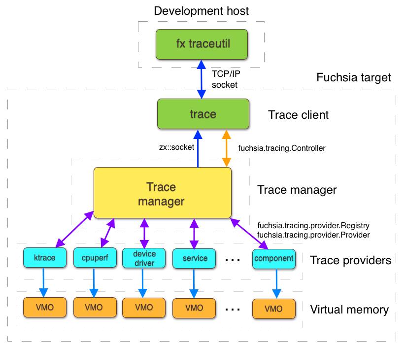

# SMOS Tracing

This document adapts the Fuchsia tracing guides to the SMOS Zircon checkout.
It explains how trace data is produced, collected, encoded, and analyzed, then
maps those concepts to the tracing hooks that are present in SMOS. Fuchsia
commands and protocols are reference points; a product build must confirm that
the corresponding service, capability, category, and kernel configuration is
enabled.

## Tracing model



Tracing records fine-grained events for a short observation window. Unlike
sampling-based profiling, tracing can preserve every instrumented event and its
arguments, which makes it useful for reconstructing ordering, latency, and
cross-thread interactions. Profiling is generally a better first step when the
hot path is unknown and adding instrumentation is not practical.

The workflow has three stages:

1. **Instrument**: surround important operations with trace events and choose
   stable categories and argument names.
2. **Record**: select categories, start collection, and save the trace archive
   or kernel trace buffer.
3. **Analyze**: inspect the result in Perfetto or another format-aware tool and
   correlate events by process, thread, CPU, object, and timestamp.

Tracing is normally disabled. Enabling a category is a runtime decision and
does not imply that every provider or kernel event is present in the target
image.

## System architecture

The Fuchsia tracing design separates producers from consumers:

| Part | Responsibility |
| --- | --- |
| Trace provider | Emits records into its assigned trace buffer VMO. |
| Trace manager | Controls collection, reads buffers, and builds the archive. |
| Trace client | Requests start/stop/save and receives the archive over a socket. |
| Trace viewer | Decodes the archive, commonly with the Perfetto UI. |

Providers write their shared VMO but never read it. The trace manager reads the
VMO but does not write provider records. The client receives a stream from the
manager and does not access provider buffers directly. This ownership split
prevents a client from changing data while a provider is recording.

Provider registration uses the `TraceProvider` protocol and the
`fuchsia.tracing.provider.Registry`. Collection control uses the
`fuchsia.tracing.controller.Controller` protocol. A provider receives a FIFO
handle for start/stop coordination and encodes records using the Fuchsia trace
format. A provider that joins while a trace is active can be started by the
manager if its categories match the current request.

The normal collection path is:

```text
trace client
  |
  +--> trace manager -- register/start --> trace provider
  |                                      |
  |                                      +--> write trace records --> VMO
  |
  +<-- archive over socket <-- manager reads and validates provider VMOs
```

At stop, the manager asks active providers to finish, waits for their
acknowledgements, validates the buffers, and sends the resulting archive. A
provider that terminates after writing valid records may still contribute a
partial trace. A full provider buffer follows its selected buffering mode.

SMOS also exposes the kernel `ktrace` path. Kernel records are written by
`lib/ktrace` macros and kernel call sites into kernel trace buffers; the debug
control path starts and stops collection and a save operation exports the
buffer. This path is independent of whether a userspace trace provider is
available.

## Categories and event types

Categories are short ASCII names such as `kernel:sched`, `kernel:ipc`, and
`kernel:syscall`. They are global to a trace request, so a component should
namespace product-specific categories. A category is not recorded merely
because an event is compiled in; the trace client must enable it.

The common event kinds are:

| Event | Meaning | Typical use |
| --- | --- | --- |
| Instant | One point in time. | Mark a state transition or milestone. |
| Duration | Begin/end interval on one thread. | Measure an operation's latency. |
| Counter | Numeric value at a timestamp. | Track queue depth or memory. |
| Flow | Connect related steps across threads. | Follow an IPC or scheduler request. |
| Async | Independent begin/instant/end. | Track work spanning callbacks. |
| Kernel object | Process, thread, or object metadata. | Resolve koids in a viewer. |
| Blob/log | Opaque bytes or diagnostic text. | Attach non-scalar diagnostic data. |

Use duration events for nested work on one thread and flow or async events when
the logical operation crosses a queue, thread, or process. End events must use
the same category and event name as their begin event. A flow identifier must
remain stable for the lifetime of that flow.

Arguments should be small and typed. Supported encodings include null,
signed/unsigned integers, floating-point values, strings, pointers, koids, and
booleans. Prefer a descriptive key and a scalar value. Pointers are useful for
diagnostics but are process-local addresses, not stable object identities;
kernel or process/thread koids are preferable for cross-event correlation.

## Adding tracing to a component

The upstream component workflow is:

1. Register the component as a trace provider.
2. Route the provider registry capability through the component topology.
3. Add trace macros around operations and assign categories.
4. Record a trace with the selected categories and inspect the result.

The provider must tolerate tracing being off. Event arguments should not cause
observable behavior changes when the category is disabled. Expensive argument
construction can be guarded by `TRACE_CATEGORY_ENABLED` or the equivalent
language API.

### C and C++ event macros

The Fuchsia C/C++ macro family includes:

| Macro | Role |
| --- | --- |
| `TRACE_ENABLED` | Test whether tracing is globally active. |
| `TRACE_CATEGORY_ENABLED` | Test a category before expensive work. |
| `TRACE_INSTANT` | Emit an instant event. |
| `TRACE_COUNTER` | Emit a counter value. |
| `TRACE_DURATION` | Emit a scoped duration. |
| `TRACE_DURATION_BEGIN` / `TRACE_DURATION_END` | Explicit duration lifetime. |
| `TRACE_ASYNC_BEGIN` / `TRACE_ASYNC_INSTANT` / `TRACE_ASYNC_END` | Async work. |
| `TRACE_FLOW_BEGIN` / `TRACE_FLOW_STEP` / `TRACE_FLOW_END` | Cross-thread flow. |
| `TRACE_BLOB_EVENT` / `TRACE_BLOB_ATTACHMENT` | Store binary payloads. |
| `TRACE_KERNEL_OBJECT` | Add kernel object metadata. |

The exact argument macro depends on the value type. Keep event names stable so
existing trace analysis and dashboards remain useful. C++ scoped duration
macros are preferred for paths with multiple returns because scope exit closes
the event automatically.

### Rust events

Rust providers use the corresponding tracing crate APIs for instant, duration,
counter, flow, and async events. The same category, argument, and lifetime
rules apply. A Rust provider still registers through the tracing provider
protocol and must route the required capabilities.

## Recording and visualization

SMOS provides the target-side `trace` utility for provider and kernel records.
It selects categories, starts a trace session, and writes an `.fxt` archive to
the target filesystem. The exact flags and available categories depend on the
product assembly. Perfetto at <https://ui.perfetto.dev/> can be used as an
offline viewer when the saved archive is transferred by an approved method.

Typical category selections are:

```text
smos:> trace list-categories
smos:> trace record --duration=2 --spawn \
             --output-file=/tmp/run.fxt -- /boot/bin/loadgen 1
```

The `--spawn` option is required when the trace command starts the target
program. Treat the flags and category list as product-specific and confirm the
installed `trace` help before using them in a test procedure. Useful categories
include scheduler/thread metadata (`kernel:sched`, `kernel:meta`), IPC
(`kernel:ipc`), syscalls (`kernel:syscall`), and graphics (`gfx`) when the
product includes those providers.

### SMOS kernel tracing

The SMOS checkout contains `lib/ktrace`, kernel trace call sites, and a debug
control service. The documented kernel workflow is:

```text
smos:> ktrace start 4
smos:> ktrace stop
smos:> ktrace save /data/sched.ktrace
```

Group mask `4` selects the scheduler group in the current `ktrace` definitions.
Other masks are defined by `KTRACE_GRP_*` in
`zircon/system/ulib/zircon-internal/include/lib/zircon-internal/ktrace.h`.
Saving requires the kernel debug resource and a writable destination.

The dash Fuchsia command bridge also provides `dm ktraceon` and `dm ktraceoff`
to toggle kernel tracing through `fuchsia.kernel/Debug`. These toggles do not
replace `ktrace start`, `ktrace stop`, or `ktrace save` when a persistent kernel
trace buffer must be exported.

## Buffering modes

Each provider chooses how to behave when its buffer fills:

| Mode | Full-buffer behavior | Suitable for |
| --- | --- | --- |
| Oneshot | Stop accepting new records. | Short deterministic captures. |
| Circular | Overwrite the oldest records. | Capturing the lead-up to a late failure. |
| Streaming | Deliver data while recording. | Long-running or high-volume traces. |

Buffer size and mode are part of the recording request. A circular trace can
lose the earliest setup events, while a oneshot trace can miss the failure if
the buffer fills first. Streaming requires a client and transport that can
keep up with the provider. Kernel `ktrace` buffering has its own controls and
must not be assumed to use the userspace provider mode.

## Advanced capture

### Kernel trace

Kernel tracing records scheduler, task, IPC, interrupt, VM, syscall, probe, and
architecture groups when those groups are implemented and enabled. Scheduler
records include context switches, wakeups, queue operations, preemption, and
latency flows. Correlate the CPU, thread koid, event timestamp, and group mask
before drawing a causal conclusion.

### Boot trace

Boot tracing is enabled through the product's kernel tracing boot parameter.
The parameter must be present early enough for the kernel to initialize its
trace buffer before the event of interest. A later userspace trace request may
include the saved boot records, but only if the boot-trace integration is
enabled in that product. Check the kernel command-line and build documentation
for the target instead of assuming a universal flag.

### CPU performance trace

CPU performance tracing samples or counts hardware events such as instructions
retired, core/reference cycles, cache misses, branch mispredicts, and stalled
cycles. Configure sample rate, buffer size, duration, user/kernel scope, and
whether to attach program-counter data. Counter names and programmable events
are architecture-specific; a category documented for Intel is not a promise on
ARM64 or another SMOS target.

### Asynchronous and flow tracing

Asynchronous tracing is for work that starts in one callback and finishes in
another. Use an explicit async identifier and close every begin with an end.
Flow tracing links stages of one logical operation and is useful for queues and
IPC. A flow marker does not by itself prove that the stages executed without
blocking; combine it with duration, scheduler, and wait events.

## Trace format essentials

The Fuchsia trace format is a compact, extensible stream of 64-bit words:

- A record header identifies the record type and size in aligned words.
- A large-record header extends the size and identifies large blobs.
- Metadata records describe providers and the trace environment.
- Initialization records establish format state and indexes.
- String and thread references avoid repeating common names and koids.
- Event records carry category, name, timestamp, thread, and arguments.
- Blob, userspace-object, kernel-object, scheduling, and log records carry
  domain-specific data.

Records are aligned to 8-byte boundaries. Indexed strings and threads refer to
tables established in the archive; inline forms carry data in the record. A
decoder must honor the record size before reading optional fields, and reserved
bits must remain zero unless a format revision assigns them. New record types,
reserved fields, appended payloads, and argument types must be introduced in a
backward-compatible way and documented with their versioning rules.

## SMOS tracing call flow

The kernel scheduling trace path can be followed as a linear Code Flow:

```text
sched_block / sched_unblock / sched_preempt
  |
  +--> Scheduler::RescheduleCommon()
  |      |
  |      +--> LOCAL_KTRACE_BEGIN_SCOPE(...)
  |      +--> choose or migrate runnable thread
  |      +--> TraceContextSwitch() / TraceWakeup()
  |      `--> emit records to the per-CPU ktrace buffer
  |
  `--> ktrace stop/save
         |
         `--> export the buffer for offline decoding
```

The exact trace scope and category depend on the event. The scheduler source
contains always-on context-switch and wakeup records plus detailed scopes such
as `update_period`, `calculate_timeslice`, `sched_latency`, and queue events.
Tracing these records shows what the scheduler did; it does not by itself show
why a userspace component chose a particular workload.

## Diagnostics and interpretation

For a scheduling or latency investigation, record at least:

- process and thread koids and names;
- CPU and affinity at each context switch;
- effective priority or fair weight;
- wait object, wake source, and wake status;
- preemption timer, IPI, and VM-exit records when applicable;
- trace category, buffering mode, buffer size, and capture interval.

A trace without these correlations can show timing but not causality. Missing
records may mean that a category was disabled, a provider had no capability,
the buffer overwrote or dropped data, or the event was outside the capture
window.

## SMOS source and adaptation map

| Topic | SMOS source or interface |
| --- | --- |
| Kernel trace groups and actions | `zircon/system/ulib/zircon-internal/include/lib/` |
|  | `zircon-internal/ktrace.h` |
| Kernel trace macros | `zircon/kernel/lib/ktrace/`, `zircon/kernel/object/`, |
|  | `zircon/kernel/kernel/` |
| Scheduler trace events | `zircon/kernel/kernel/scheduler.cc` |
| Kernel debug control | `sdk/fidl/fuchsia.kernel/kernel-debug.fidl`; |
|  | dash `dm_fuchsia.cc` |
| Trace provider protocols | `sdk/fidl/fuchsia.tracing.provider/` |
| Trace controller protocol | `sdk/fidl/fuchsia.tracing.controller/` |
| Trace format reference | Fuchsia `docs/reference/tracing/trace-format.md` |

The explanatory material is adapted from Fuchsia's
`docs/concepts/kernel/tracing-system.md`,
`docs/concepts/kernel/tracing-provider-buffering-modes.md`,
`docs/development/tracing/`, and `docs/reference/tracing/` under the Fuchsia
BSD license. Product-specific commands, services, categories, and hardware
performance counters must be verified in the selected SMOS build.
